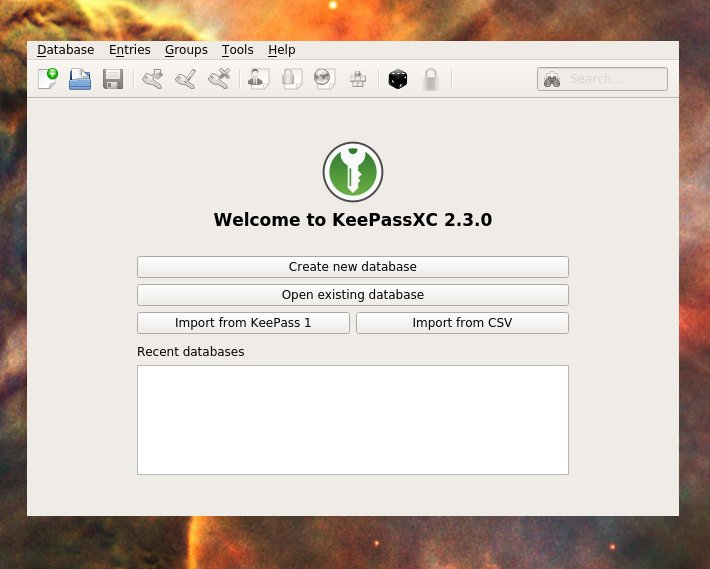
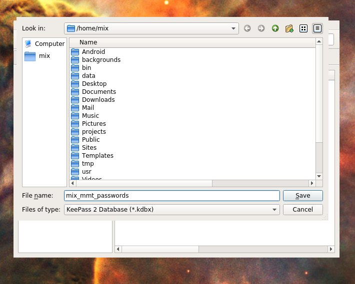
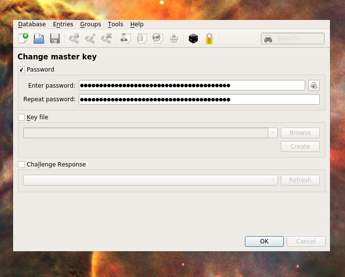
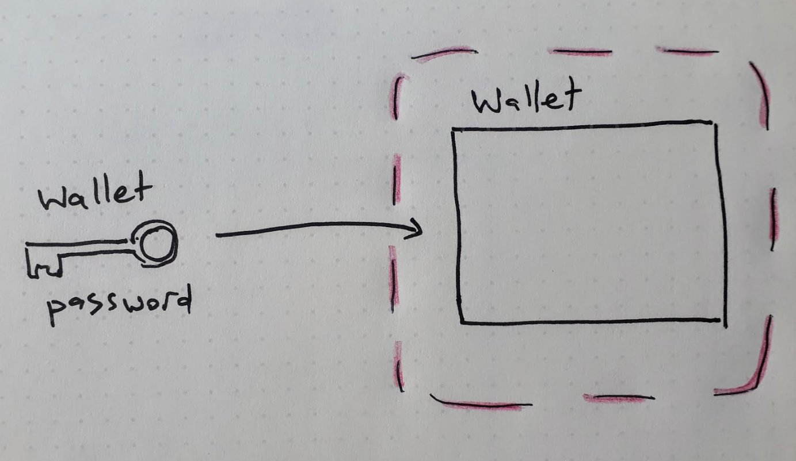
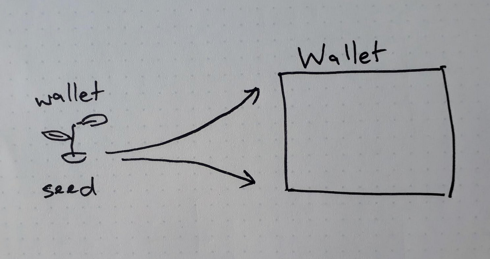
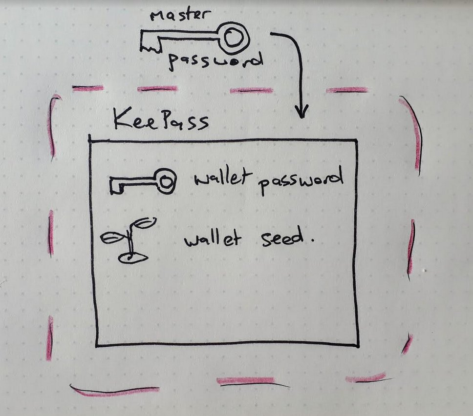
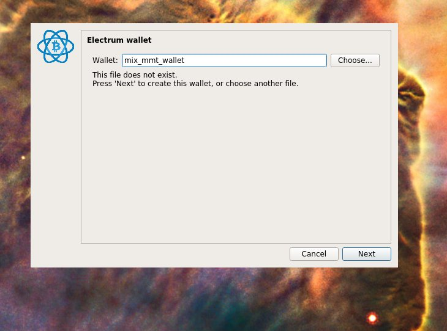
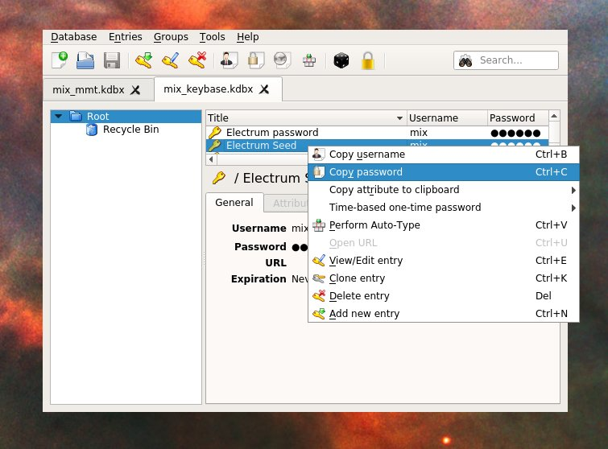

# Bitcoin setup guide (Beginners)

This guide is a lite opinionated guide to getting a bitcoin setup with reasonable reliability established.

**What you will need:**

- your own computer :computer: 
- 5 people you trust :family: (to give backup details)
- enough time :clock1: to follow steps slowly and not slip up

If you want more detail please [see **in-depth guide**](https://docs.google.com/document/d/11fJfWa5a6FX8h-2zGI5ZZFm7bNKGN6L1wWhnfrUOMQg/edit#heading=h.q9r9wfywrj12) for more details.

## Overview of Steps

1. [Setup password manager](#1-setup-password-manager)
2. [Setup bitcoin wallet](#2-setup-bitcoin-wallet)
3. [Share backup of seed](#3-share-backup-of-your-seed)
4. [Security Audit](#4-security-audit)
5. [Receive a small test payment](#5-receive-a-small-test-payment)

**Notes**
  - if you're unclear on anything, please ask.
  - :warning: = `this is a dangerous step, follow it exactly`
  - if the images are too small, make the text on your browser bigger
    - e.g. `ctrl + "+"` or `cmd + "+"`

---

## 1. Setup password manager

We're going to be working with really long secure passwords.
Good news is, all you you need is an excellent password manager and it can remember all these long passwords.
We will make this safe by setting up on one single single "Master Password" which you need to know to get into the password manager.

_Check the FAQ at the bottom of this section if you have more questions_

**What you need for this section**:
- Read over the steps before you start
- 1 Master Password
- The start of a security mindset - can someone else get into this? Can I get back into this?

1. **Install KeePassXC** 

    Get it from https://keepassxc.org/download/

    You may have to give permission to open this application as it's not from an App Store. If you get a warning try clicking things like "More info" or "?" to get to the place where you can say "Allow KeePassXC"

2. **Start a new password database**
    
    (optional) see FAQ 'what is a database?'

    1. Open KeePass, and click `[ Ceate new database ]`
    
    
    
    2. Give it a name that makes sense like "mix_mmt_passwords" and click `[ Save ]`
    
    
    
3. **Choose your "Master Password"**

    :warning: Pay close attention, being sloppy here will lose your money
    
    This is the one password you have to remember. Requirements are:
      - Never use this password _anywhere online_
      - Never use this password _for anything else_
      - Your password must be very hard for humans and computers to guess 
          - use a line from a song or poem you like 
            - e.g. _"people say she's crazy she's got diamonds on the soles of her shoes"_
          - yes make it quite long

    1. Enter your new password (twice)
    2. Press '[ okay ]'
    
    

4. **Practice saving a password**

    This is to get you used to using KeePass AND to **prove to yourself that your setup is working**  - i.e. you can get your passwords out!
    KeePass lets you make folders, a feature we don't need yet - the default base folder is called "Root"
    
    1. Save a password in:
        1. click `Entries > Add new entry` in the menu
        2. enter some test details (you need to enter the pass twice, you can click the eye to reveal the passwords). 
        3. click `[ OK ]`
        
    
    
    2. Get the password out:
        1. right click on the new entry and copy the password
        2. paste that password somewhere else to prove your password is in there ok
        - e.g. mine comes out "bumble dumble test pass", so it's worked!
        
    

5. **Check the whole thing works**

    Prove you can close everything and then retreive the password again. This is to force you to use your master password, and prove to yourself that you know how to do all this.
    
    1. Close KeePass
    2. Open KeePass (and enter your **master password** to unlock it and get in)
    3. Check you can still see that test password (e.g. copy it out)

If you've got this all sorted, you're now ready to save your bitcoin passwords super securely!

### FAQ

Q: **I've already got a password manager**, can I just use that?
  - No. This is our opinionated recommendation about the simplest safest starting point
  - (advanced) yes perhaps, but we'd need to talk through the security. Please run with this to start with
  
Q: What's a **database**?
  - it's just a filing cabinet for storing things in! (In this case 'things' = data, like passwords)
  - with KeePass the database is just a special file, e.g. 'mix_mmt.kdbx`. If you delete that file, all the passwords in it will be lost.
  - KeePass lets you set up different databases, e.g. you might like to keep your work and personal passwords totally seperated. This is a more advanced case you don't need to worry about

---

## 2. Setup bitcoin wallet

We're now goint to install the wallet that holds your actual bitcoin.
Here's a bit of an overview of what the follow steps are about:

  - Our final state is a bitcoin wallet, protected by a **wallet password** - this gives access to the wallet

  

  - We will also have a backup for our wallet
    - it turns out wallets can be _grown_ from a **seed** (a special sentence)
    - if we ever lose our wallet, we can just regrow it from the seed (and because bitcoin is pretty special, regrowing our wallet resotores the wallet to its last state, i.e. with the money in it!)

  

  - Finally, this **wallet password** and **wallet seed** are really long, and we don't want to remember them, so we use KeePass to remember them!
    - reminder: the only password you need to remember is the **master password** that gets you into KeePass

  

Check the FAQ at the end of this section for other questions.

1. **Install the Electrum wallet**

    - get it from [electrum.org/#download](https://electrum.org/#download) 

2. **Start Electrum**, and enter a name for your wallet

    

3. **Choose these setup options**: 

    - pick "Standard Wallet", click `[ Next ]`
    - pick "Create a new seed", click `[ Next ]`
    - pick "Segwit", click `[ Next ]`
    - read step 4 (our instructions are different that the wallets)

4. **Backup your seed**
    
    (see notes at the top of this section about what a seed is)

    1. Copy the seed by selecting it, right-clicking and selection "Copy"
    
    

    2. Save this seed as a new new entry in KeePass
        - call the entry **Electrum Seed**
        - refer to "Practice savings a password" (Section 1, step 4) if you want to revise how to do this

    3. Once you've done this, click `[ Next ]` in the wallet setup

5. **Use your seed backup**
    
    :warning: This step is about confirming we've save our seed correctly.
    If you don't save your backup correctly, you will not be able to recover your wallet if anything goes wrong.

    1. In KeePass, right click on your new entry called "Electrum Seed" and select "Copy password"
    2. In the wallet setup, paste this password into the box to "Confirm Seed"
    3. Click `[ Next ]`

    

6. **Set a wallet password**

    You're asked to enter a password for your wallet. We're going to get a site to make us a complex password (we won't need to memorise it)
    1. Generate a long password with https://www.rempe.us/diceware/#eff
    2. Save the password as a new entry in KeePass
        - call the entry **Electrum Password**
        - refer to "Practice savings a password" (Section 1, step 4) if you want to revise how to do this
    3. right click on the entry in KeePass and copy the password
    4. Paste this into the wallet password field (and a second time to confirm the password)
    5. if you see "encrypt wallet", make sure it's checked
    6. click `[  ]`

    You should now be in your new wallet.

7. **Check you got everything saved right!**

    Before we start moving money, we need to check we can close everyhing and get back in again.

    1. Quit out of Electrum wallet, and out of KeePass
    2. Open your wallet again
        - launch Electrum
        - remember you stored your **wallet password** in your password manager
        - open KeePass and sign in with your **master password**
        - copy the password out of KeePass and use it to unlock your wallet

### FAQ

Q: **Why do I need to install a wallet, can't I just use coinbase?**
  - with coinbase, your wallet actually lives on their servers, putting control in the hands of the people running those computers
  - in the history of bitcoin so far it's been fairly common for these servers to get hacked and for everyone using them to loose all their bitcoin.
  - by holding the wallet ourself, we learn about what's involved behind the scenes, and are better protected from theft

---

## 3. Share backup of your seed

> :warning: **NOTE** :warning: - this section will get a revision with a more secure offline solution

So you've got this Seed - a phrase from which you can regrow your wallet. We need to protect your organisation against the eventuality that you get hit by a bus (OR your computer is lost).

There's a neat trick that lets you 'shard' (split) your seed into 5 parts. You can recreate your seed by bringing any 3 of the parts together again.

1. Copy your `Electrum Seed` (from KeePass) into https://secrets.dyne.org/share
2. :warning: Double check you just copied the seed phrase!
3. Click `Submit`
4. Send each of the 5 'shards' (one shard per line) to a different friend
    - (dyne calls shards 'shares')
    - send the shards over different comms channels
    - tell the person you're sending it to what it is!

5. (optional) Test you can put your seed back together
    - go to https://secrets.dyne.org/combine
    - paste in any 3 of the shards and click `submit`
    - compare with your original seed!

## 4. Security Audit

A few due dilligence questions:

- [ ] Are you in ownership of the private key? (seed)
- [ ] Have you backed up the private key?
- [ ] Have you confirmed all 5 of your trusted people have received a shard of you private key ? 

Technically that’s all I need, but unless the above are anwswered you are assuming the individual risk of the value of the tokens… is this risk you want to take on as an individual? There are ways we can mitigate this :)

## 5. Receive a small test payment

1. In Electrum, go to the Receive tab and copy your `Receive Address`
2. Give this address to someone who is going to send you bitcoin

