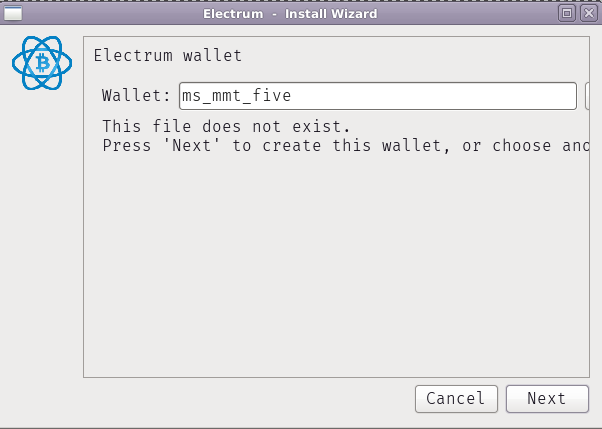
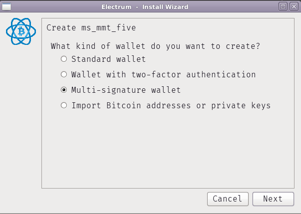
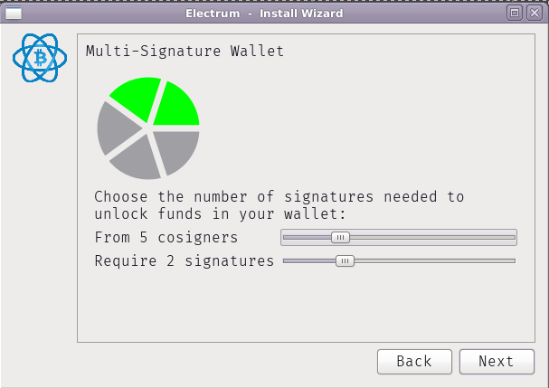
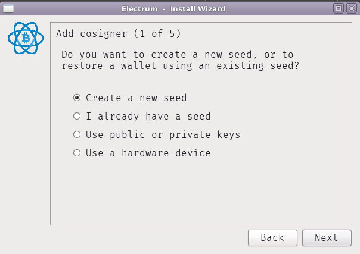
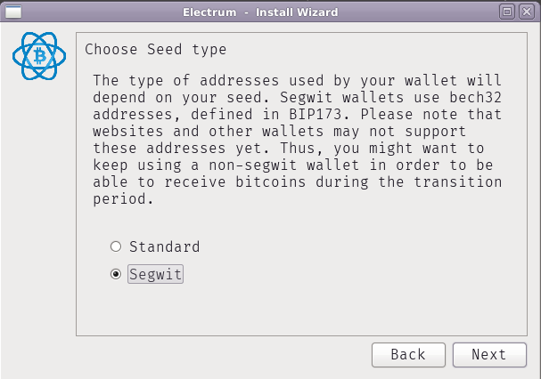
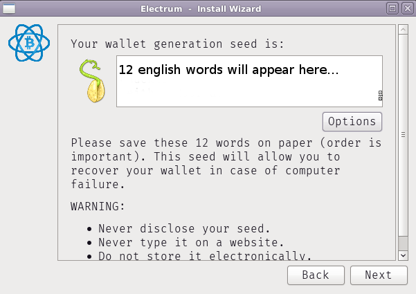
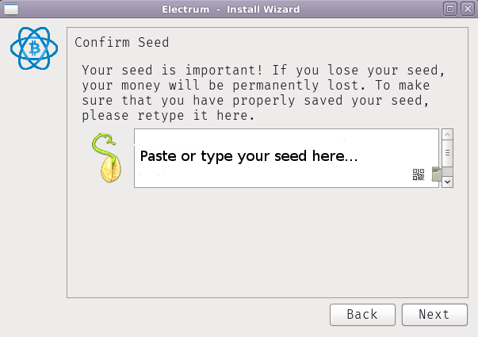
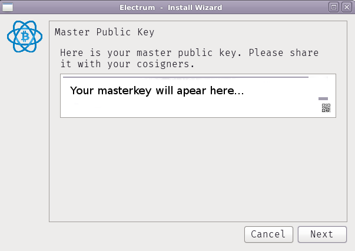
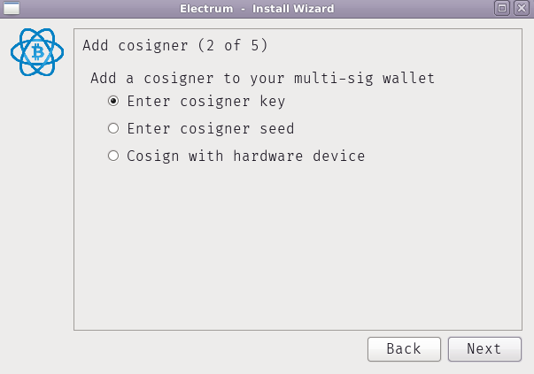

# MMT: Let's create a bitcoin multisig wallet (async)

**Notes**
  - THIS IS IN DRAFT MODE :boom:
  - if you're unclear on anything, please ask.
  - :warning: = `this is a dangerous step, follow it exactly`
  - if the images are too small, make the text on your browser bigger
    - e.g. `ctrl + "+"` or `cmd + "+"`
    
**Assumptions**

- The group of people setting up this multisig wallet will be unable to physically meet up.
- The group of people setting up this multisig wallet will be unable to run through the setup process synchronously (at the same time over phone / skype / etc )

**Overview**

This process will happen in **four** main stages
  1. An individual runs through the establishment of a new multisig wallet up to the point they generate their own seeds / master key. They will then be able to **close** their electrum wallet.
  2. All individuals in the group run through the process individually to generate and then **share** their seeds/master keys privately with the group.
  3. Once all master keys/seeds have been gathered privately within the group each individual can run through the entire process this time inputting all master keys / seeds.
  4. Once everyone has set up their wallets there is a check to make sure everyone is seeing the same bitcoin addresses. If so, the group has successfully run established a collectively governed and owned multisig electrum wallet.
  
  ---

Electrum has a pretty good GUI for making a multi-sig wallet. It seems designed for synchronous usage, but we can do it asynchronously by making multiple passes - first, to create your wallet seed (and familiarize yourself with the options), and then later, after we exchange public keys, to create the wallet. Here are instructions:

- Start Electrum
- If you are not prompted with the Install Wizard (e.g. because already have an Electrum wallet), click New/Restore in the File menu
- Name the wallet. The name will not matter at this point. In the example I have noted ms_mmt_five (ms for multisig, mmt for the the project & five for the number of cosigners)

- Select "Multi-signature wallet" as the kind of wallet

- Pick parameters for the wallet. We have elected 5 cosigners and require 2 signatures. Playing with these parameters may be a good research area. During our Ceremonial Invokation of BTC Multisig Wallet we (Dan, Kieran, Mix, Peg) decided have fewer required signatories would increase the vibe of trust within our group.

- It should then prompt you to add the first cosigner. That will be you. I recommend choosing "Create a new seed". Usually I would recommend using a hardware wallet if you have one, but in this case you will have to share the "master public key" which can be used to derive all your wallet's public keys, and maybe you wouldn't want that. (There is supposed to be a way to choose an alternate account in this case, but Electrum doesn't seem to have that implemented in the version that I used).

- Pick seed type. We have elected for "Segwit" as an increasing number of services default to this, with interoperability increasing and this being the future of development within bitcoin.

- Follow steps to generate and save the seed. I recommend writing it on paper, as they suggest, and keeping that paper safe. We have also been teaching people to use KeepassXC. User friendly backup schemas and processes may be a good research area.

- Confirm the seed

- It should then present you with the "master public key" (xpub) derived from your seed. Copy it. Initial suggestion is that you add this to your KeepassXC entry (with your seed).

- Next, it will start prompting you to add cosigners. We are not ready to do this yet, so you can now close the install wizard. (Press Back a couple times and then Cancel)

- Post your xpub to this mmt private channel: %Bg6nwHM...
- Now, to make a wallet, we will need to wait for everyone to publish their xpub to the private channel.
Once that happens we will all verify that we are all seeing the same addresses. Instructions for this will follow once we get there.

Again, many thanks to @cel for their initial process. The steps you see outlined above are more or less his work verbatim :)
