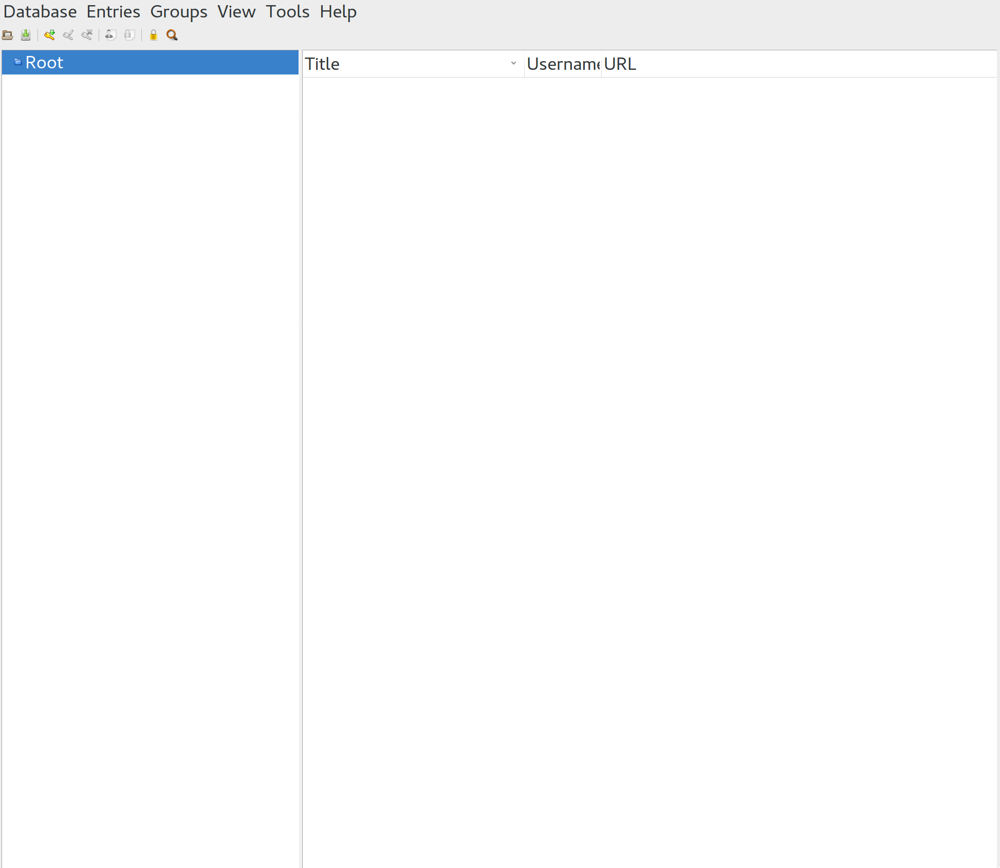
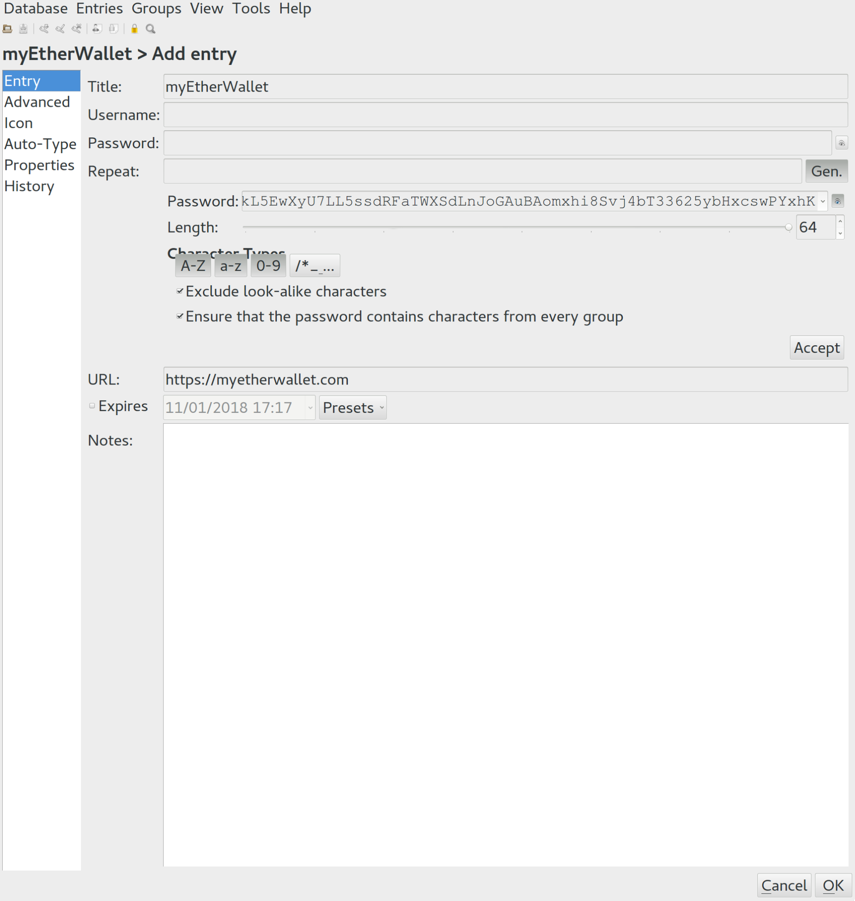
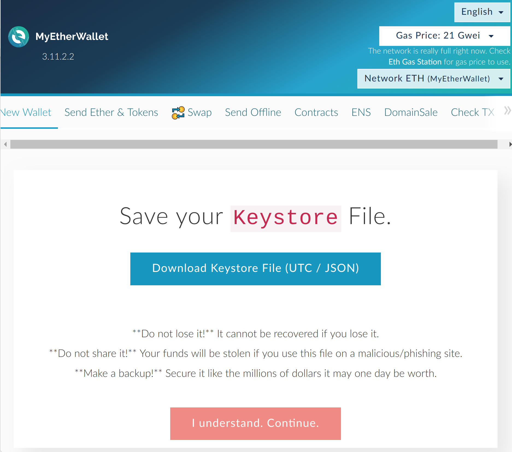
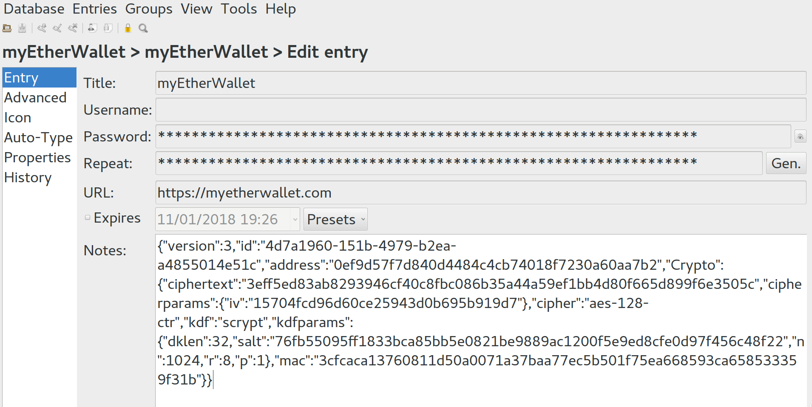
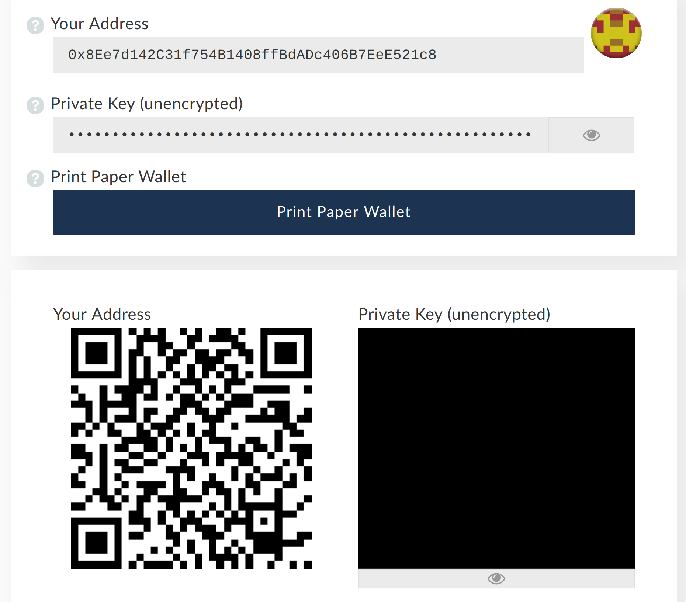
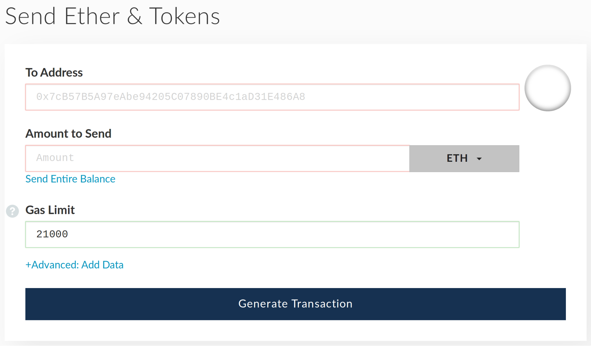
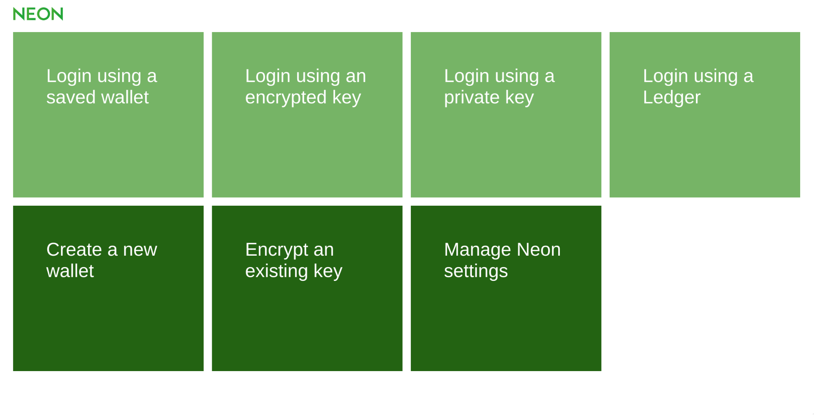
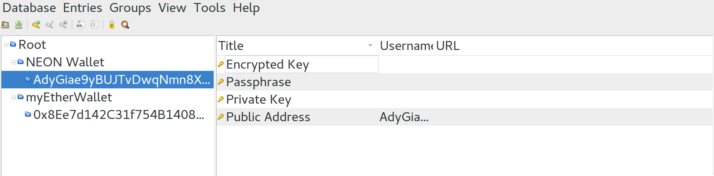

# An Introduction to Cryptocurrency

## DISCLAIMER

We are not providing financial advice, nor are we financial advisors. This is our approach to balancing personal security alongside convenience in the context of crypto-currency. It does not guarantee complete security. Personal vigilance is required to ensure our approach works properly. This includes having legitimate anti-virus and anti-malware software installed, as well as being critical of URLs you visit and aware of phishing techniques. We provide the pros and cons of the mechanism we teach in this workbook, as well as alternatives. In the Resources we also provide some means to learn about phishing and hacking to protect yourself.

## Staying Secure

The most important aspect of learning to use cryptocurrency is learning how to
securely relate to the internet. First and foremost, this means rethinking how
you manage your passwords.

Data breaches occur across the modern internet on a daily basis and its often
very easy for a bad actor to gain access to the information obtained in these
breaches. People’s personal information can be bought for a pretty penny on the
dark web, often including an email and password. Very often companies won’t
even be aware they’ve had a data breach until the data is leaked.

It’s not practical for us to remember multiple different complex passwords for
multiple different emails. We’re liable to forget, and lose access to these
accounts. So most people either have a website specific technique for
generating new passwords, or use the same one for nearly every account. If
you’re the kind of person who uses the same password and email for multiple
different sites, this is a serious problem.

We recommend using a password manager to safely and reliably secure your
passwords.

<table class="c30"><tbody><tr class="c4"><td class="c20 c17" colspan="1" rowspan="1">
Operating System
</td><td class="c17 c46" colspan="1" rowspan="1">
Software
</td><td class="c31 c17" colspan="1" rowspan="1">
Download
</td></tr><tr class="c4"><td class="c20 c17" colspan="1" rowspan="1">
Windows
</td><td class="c46 c17" colspan="1" rowspan="1">
KeePass v2.38
</td><td class="c31 c17" colspan="1" rowspan="1">
<a class="c19" href="https://www.google.com/url?q=https://keepass.info/download.html&amp;sa=D&amp;ust=1518175165767000&amp;usg=AFQjCNEn9EijOOKSwO8K9ElwsLuWub7c2Q">https://keepass.info/download.html</a>&nbsp;
</td></tr><tr class="c4"><td class="c20 c17" colspan="1" rowspan="1">
Mac
</td><td class="c46 c17" colspan="1" rowspan="1">
KeePassX v2.0.3
</td><td class="c17 c31" colspan="1" rowspan="1">
<a class="c19" href="https://www.google.com/url?q=https://www.keepassx.org/&amp;sa=D&amp;ust=1518175165768000&amp;usg=AFQjCNEJ_Bo2DHzlNuDDqjOtHirlsS9wwA">https://www.keepassx.org/</a>&nbsp;
</td></tr><tr class="c4"><td class="c20 c17" colspan="1" rowspan="1">
Linux
</td><td class="c46 c17" colspan="1" rowspan="1">
KeePassX v2.0.3
</td><td class="c31 c17" colspan="1" rowspan="1">
<a class="c19" href="https://www.google.com/url?q=https://www.keepassx.org/&amp;sa=D&amp;ust=1518175165769000&amp;usg=AFQjCNFhV-dEFJBuGoOan77DI1NHxRfCMw">https://www.keepassx.org/</a>&nbsp;
</td></tr><tr class="c4"><td class="c17 c20" colspan="1" rowspan="1">
Android
</td><td class="c46 c17" colspan="1" rowspan="1">
KeePassDroid
</td><td class="c31 c17" colspan="1" rowspan="1">
Google Play Store
</td></tr><tr class="c4"><td class="c20 c17" colspan="1" rowspan="1">
iPhone / iPad
</td><td class="c46 c17" colspan="1" rowspan="1">
iKeePass or MiniKeePass
</td><td class="c31 c17" colspan="1" rowspan="1">
Apple Store
</td></tr></tbody></table>

There are other options such as MasterPassword. We have not used these. Make
sure you have a standardised methodology for storing passwords. We recommend
KeePass encrypted database files (.kdbx) stored on multiple cloud-storage
providers.

# Risks

## Hot and Cold Storage

Cold or Hot storage describe accessibility models to storing data. Many suggest
this is a necessary precaution especially when working with large amounts
crypto-currency. Cold storage can take the form of a USB flash device, writing
the data on paper, or using a hardware ledger. Hot storage is online and
connected to the internet in one way or another. There are implicit risks in
either approach and its necessary to balance your own requirements to suit
needs. In the long run, we recommend using a Cold Storage mechanism. In the
short term, it makes sense to learn a tried and tested Hot Storage methodology
to enable swift access. Transition to Cold Storage using a ledger can come once
you become familiar with the terminology.

Check out link for further information regarding the importance of properly
storing cryptocurrencies

[medium article - how to properly store bitcoins and other cryptocurrencies](https://medium.com/@nellsonx/how-to-properly-store-bitcoins-and-other-cryptocurrencies-14e0db1910d)

### What are the pros and cons of hot and cold storage?

<table class="c30"><tbody><tr class="c48"><td class="c16 c17" colspan="2" rowspan="1">
Hot Storage
</td></tr><tr class="c4"><td class="c29 c17" colspan="1" rowspan="1">
Pros
</td><td class="c29 c17" colspan="1" rowspan="1">
Cons
</td></tr><tr class="c4"><td class="c29 c17" colspan="1" rowspan="1">
Free and global access, you only need an email address to create an account with a cloud provider
</td><td class="c29 c17" colspan="1" rowspan="1">
You do not technically control the data. Someone else is in effect the custodian.
</td></tr><tr class="c4"><td class="c29 c17" colspan="1" rowspan="1">
It&rsquo;s likely if there were a major data leak at Google or Dropbox, you&rsquo;d know about it and be able to secure your accounts by changing the passwords before your database gets hacked
</td><td class="c29 c17" colspan="1" rowspan="1">
If the cloud gets hacked, someone can get your password database. However, the still can&rsquo;t gain access until they crack the master passphrase
</td></tr><tr class="c4"><td class="c29 c17" colspan="1" rowspan="1">
Using multiple cloud providers and syncing the files makes it easier to ensure this doesn&rsquo;t happen
</td><td class="c29 c17" colspan="1" rowspan="1">
If your cloud provider goes down you can&rsquo;t gain access to your passwords
</td></tr><tr class="c48"><td class="c16 c17" colspan="2" rowspan="1">
Cold Storage
</td></tr><tr class="c4"><td class="c29 c17" colspan="1" rowspan="1">
Pros
</td><td class="c29 c17" colspan="1" rowspan="1">
Cons
</td></tr><tr class="c4"><td class="c29 c17" colspan="1" rowspan="1">
You are the single point of failure - You control everything
</td><td class="c29 c17" colspan="1" rowspan="1">
You are the single point of failure - You only have yourself to blame if you screw up
</td></tr><tr class="c4"><td class="c29 c17" colspan="1" rowspan="1">
Access depends on the format (Paper / USB / Ledger)
</td><td class="c29 c17" colspan="1" rowspan="1">
Paper can be lost, USB can be lost. Ledger costs money.
</td></tr></tbody></table>

While the approach we advocate is a significant improvement on using a single
password for multiple accounts, it is not full proof. The risks for loss
include:

- Your cloud service provider goes offline for good. This is unlikely, but
  still a possibility.

- It is likely that if Google were to go down overnight, we might have bigger
  problems on our hands than accessing our passwords.
- For crypto wallets, we recommend keeping a paper copy of your private key
  to enable access to these funds in the eventuality of Google, Microsoft,
  Apple and Dropbox going down.

- Data breach at your cloud service provider and your encrypted database
  stolen. While it is highly unlikely someone can break into this database,
  it is not theoretically impossible.

- In the event of a major data breach at Google, Microsoft or Apple there are
  likely to be larger interests at work than gaining access to your crypto
  wallet.
- The computing power required to crack your database would buy you time to
  access your wallet with your paper private key and move the funds out
  before the hacker/s gain access.

## Methods of cracking passwords

### Brute force attack:

A trial and error method which iterates through all possible combinations of
legal characters in sequence. Brute force is considered to be an infallible,
although time-consuming, approach.

### Dictionary attack:

Uses common sentence structure and a list of works (such as a dictionary) to
attempt to piece together all possible outcomes in a sentence.

----

## Setting up KeePass / KeePassX

NOTE: KeePass and KeePassX have slightly different user interfaces, but the
functionality remains the same. Windows users will be using KeePass. UNIX
machines (Mac, Linux) use KeePassX. We have provided screenshots for KeePassX
but the icons and process for KeePass is the same.

1. Download, install and run the relevant software for your operating system.
2. Click “Database” in the menu bar, and “New Database”
3. Choose a master password. This will be the only password you have to
   remember. It is extremely sensitive information. We recommend using
   something both easily memorisable and difficult to guess or hack. This
   could be a line from your favourite poem or song. Or better yet, you can
   generate a cryptographically secure password using the following tool: 
   https://www.rempe.us/diceware/. Diceware generates a random series of words
   that are easily rememberable with little association. It makes them less
   vulnerable to both “brute force” and “dictionary” attacks.

NOTE: This password should never be used online. This is purely an offline
password. Never use the password for anything other than this password
database. If you feel like you want to back it up somehow, write it down, and
hide it somewhere. Or better yet, hide in plain sight.

4. Save the database file locally. This is now your password database. Before
   we input any passwords, we’ll make sure you are able to access it globally.
   We will delete this file eventually, so just save it on your desktop.
5. Upload to one or more (we recommend at least 2) cloud providers, such as
   Google Drive, Dropbox, OneDrive, or iCloud.

NOTE: If you using a cloud provider that use a synchronised local folder, such
as Dropbox, it adds an element of convenience, but care must be taken. If you
unlock your password database while connected to Dropbox and it attempts to
sync, it will make your password database vulnerable to someone spying on your
connection. Make sure you turn off Dropbox when you are accessing your
database, and turn it back on afterwards to sync any changes to the cloud.

6. KeePass allows you to organise your passwords into a tree-like folder
   structure. You can create groups and entries. Groups are like folders and
   entries are like files.

<table class="c30"><tbody><tr class="c4"><td class="c59" colspan="1" rowspan="1">

</td></tr><tr class="c4"><td class="c59" colspan="1" rowspan="1">
Fig. 1 &lsquo;Root&rsquo; group. Sub-groups can be added.
</td></tr></tbody></table>

7. Right click on the “Root” group, and click “Add new group”. Set the name to
   myEtherWallet.
8. Click on the key icon to “Add Entry”.
9. Enter the title as myEtherWallet
10.  Enter the URL: https://myetherwallet.com 
11.  Click on the “Gen” button, set length to 64 and select A-Z a-z and 0-9.
    This will generate a random password 64 characters long using all
    characters A-Z upper and lower case and numbers 0-9. (See Figure. 2)
12.  Click “Accept”. To view the password, click on the eye icon.

<table class="c30"><tbody><tr class="c80"><td class="c16" colspan="1" rowspan="1">
&nbsp; &nbsp; &nbsp; 
</td></tr><tr class="c66"><td class="c16" colspan="1" rowspan="1">
Fig. 2 Generating a password 
</td></tr></tbody></table>

13.  Click “OK” and then save the database.

----

### Setting up myEtherWallet

1. Visit https://myetherwallet.com 
2. Select “New Wallet” and paste in the password you generated in your KeePass
   entry.
3. Click “Create New Wallet”.
4. Click “Download Keystore File (UTC / JSON) and save the file to your
   desktop. In the future you will use this to access your wallet. (See
   Figure. 3)

<table class="c30"><tbody><tr class="c4"><td class="c16" colspan="1" rowspan="1">

</td></tr><tr class="c4"><td class="c16" colspan="1" rowspan="1">
Fig. 3 Download JSON Keystore file
</td></tr></tbody></table>

5. Open file with a plain text editor such as Notepad or Vim.
6. Copy and paste the contents to KeePass. You can do this either in the notes
    section, or as a password in a new entry (See Figure. 4). Double check you
    still have the original password, and the contents of the keyfile. Save
    your KeePass database.

<table class="c30"><tbody><tr class="c4"><td class="c16" colspan="1" rowspan="1">

</td></tr><tr class="c4"><td class="c16 c38" colspan="1" rowspan="1">
Fig. 4

Pasted JSON keystore file into notes. We recommend creating a new entry rather than placing in notes. This prevents screen sharing malware stealing the keystore file contents.
</td></tr></tbody></table>

7. Delete Keystore/JSON file from your desktop. Empty your recycling bin.
8. Return to your browser. Click “I understand. Continue.”
9. Copy your private key and paste it, either into the notes section of your
   myEtherWallet entry, or as a password in a new entry. Make sure you specify
   that it is your ‘Private Key’. Save your KeePass database.

NOTE: Your Private Key is the master key to your wallet. This can never be
recovered. We recommend creating a ‘cold storage’ copy on paper and storing it
somewhere safe. myEtherWallet provides the option to “Print Paper Wallet” when
you open your wallet. We recommend printing this, not saving it on your
computer.

10.  You should now be able to access your wallet. Select Keystore / JSON file
    and click “SELECT WALLET FILE…”
11.  Copy and paste the Keystore/JSON from your KeePass and save it in an plain
    text file.
12.  Select this file with the browser.
13.  Return to KeePass, right click on the entry containing your password, and
    select copy password and paste the now copied password into the password
    field on myEtherWallet.com Click “Unlock”. This will reveal your wallet.
14.  Copy “Your Address” contents. This is your public address. This is what
    you will share with others to allow them to send you Ether (and other
    ERC20) tokens. Paste this into your KeePass entry as the username. Save
    your KeePass database.
15.  You now have an Ether (ETH) wallet! Close and open it again to make sure
    it wasn’t a fluke!

<table class="c30"><tbody><tr class="c83"><td class="c16" colspan="1" rowspan="1">

</td></tr><tr class="c4"><td class="c16 c17" colspan="1" rowspan="1">
Fig. 5

Your Ether Wallet contains a public address &amp; private key.
</td></tr></tbody></table>

### Running myEtherWallet Locally and sending transactions offline

For the sake of convenience, during this workshop we will send transactions
through the online myEtherWallet website. However, myEtherWallet recommend that
it is better to do this activity offline. This minimises the exposure of your
private key or keystore file and passphrase to the internet (which should be
zero).

myEtherWallet provide easy to follow written tutorials on how to do this:

- [Running myEtherWallet Locally](https://myetherwallet.github.io/knowledge-base/offline/running-myetherwallet-locally.html) 
- [Sending a transaction](https://myetherwallet.github.io/knowledge-base/offline/making-offline-transaction-on-myetherwallet.html) 

### Send and Receive

<table class="c30"><tbody><tr class="c4"><td class="c16" colspan="1" rowspan="1">

</td></tr><tr class="c4"><td class="c16 c17" colspan="1" rowspan="1">
Fig. 6

Send Ether token by entering another public address. Gas is the measure of computational power required to execute the transaction.
</td></tr></tbody></table>

### Send ETH

1. Click “Send Ether & Tokens”
2. Enter an address to send to
3. Enter an amount of Ether to send
4. Ensure Gas Limit is 21000 (the minimum required to complete a transaction).
5. Click “Generate Transaction”
6. Click “Send Transaction”
7. Visit https://etherchain.org and paste in the transaction hash to the
   search bar.
8. You should see the transaction being confirmed

### Receive ETH

1. Send to the sender your public address. Wait for personal confirmation they
   have sent the ether.
2. Visit https://etherchain.org and paste the destination (your) public
   address into the search bar
3. You should see the ether arrive once the transaction has had sufficient
   confirmations.

### Saving to the Cloud

1. Ensure you have saved your KeePass database.
2. Open your selected cloud provider. We’ll use Google Drive to demonstrate.
3. Click “New” and select the KeePass database file (ends with .kdbx)
4. Wait until the file is uploaded.
5. Delete the KeePass file from your computer.

NOTE: It is extremely important with this method of storing passwords that you
maintain a singular source of “Truth”. This means that you should never have
more than one copy of the KeePass on your local computer. If you store it in a
USB as well as on the cloud, make sure that they are synchronised. This
requires personal vigilance. It is imperative that you don’t end up with
diverging versions. Diverging versions is a sure fire way to lose passwords or
information. Make sure that the one you add new information is the most up to
date one. By deleting the file locally, we ensure that the source of truth is
always the one we’ve uploaded to the cloud.

----

## Setting up Neon Wallet

The Neon Wallet is a cross-platform light wallet that allows you to interact
with the NEO blockchain without syncing your computer. NEO is a Chinese
blockchain with a platform for smart contracts (scripting / app development).

You can download most stable version from the following links:

- [City of Zion Github](https://github.com/CityOfZion/neon-wallet/releases) 
- [NEON Wallet](http://neonwallet.com/)

<table class="c30"><tbody><tr class="c4"><td class="c16" colspan="1" rowspan="1">

</td></tr></tbody></table>

1. Click “Create new wallet”
2. Create new group in Keepass called NEON Wallet and a new sub group. This
   sub-group will specify your public address so if you wish to have multiple
   wallets they remain well separated. Set the group name as your public
   address. SAVE
3. Generate passphrase using Diceware (https://www.rempe.us/diceware/) or
   constructing a memorable phrase or sentence.
4. Create a new entry inside this group and copy your brain passphrase to the
   password section. Add Passphrase as the title. SAVE
5. Create a new entry inside this group and copy your encrypted key from NEON
   to the password section. Add Encrypted Key as the title. SAVE

NOTE: This is not the same as your private key. Together, your encrypted key,
your passphrase and your public address can be combined to reveal your private
key.

6. Create a new entry inside this folder and copy the private key from NEON to
   the password section. Add Private Key as the title. SAVE
7. Create a new entry inside this group and copy the public address from NEON
   to the username section.

<table class="c30"><tbody><tr class="c4"><td class="c16" colspan="1" rowspan="1">

</td></tr><tr class="c4"><td class="c16 c17" colspan="1" rowspan="1">
Fig. 6

4 entries for each address, one for each key and one for the public address, stored in a group named after the public address
</td></tr></tbody></table>

8. Ensure you have a NEON group and a subgroup with a public address. The
   subgroup should contain 4 entries, your passphrase, your encrypted key,
   your private key and your public address.  SAVE
9. NEON wallet gives you the option to “Save Key”. This will make it easier to
   open your wallet next time on this computer by only providing your
   passphrase. OPTIONAL
10. Write down or print your private key and store in a secret location.

NEON gives you 4 different ways to access a NEO blockchain wallet:

<table class="c30"><tbody><tr class="c4"><td class="c54 c17" colspan="1" rowspan="1">
Using a saved wallet 
</td><td class="c60 c17" colspan="1" rowspan="1">
If you chose the &ldquo;Save Key&rdquo; option, you should be able to select your wallet from the dropdown on this screen and enter your passphrase
</td></tr><tr class="c4"><td class="c54 c17" colspan="1" rowspan="1">
Using an encrypted key
</td><td class="c17 c60" colspan="1" rowspan="1">
Provide both your passphrase and your encrypted key to log in
</td></tr><tr class="c4"><td class="c17 c54" colspan="1" rowspan="1">
Using a private key
</td><td class="c60 c17" colspan="1" rowspan="1">
Provide only your private key to login.
</td></tr><tr class="c4"><td class="c54 c17" colspan="1" rowspan="1">
Using a ledger
</td><td class="c60 c17" colspan="1" rowspan="1">
Hardware wallet using the Ledger Nano S
</td></tr></tbody></table>

NOTE: We recommended that you login using your encrypted key and passphrase,
not your private key. Keeping exposure of your private key to your computer to
a minimum is recommended, this minimises opportunity for a bad actor / malware
to rob you of your wallet.

### Send NEO

Enter a valid NEO address, choose the amount and click send. NEO is not
divisible. While trading sites allow for NEO to be divisible internal to their
sites, if you send a subdivision of a NEO, you will lose the excess. For
example. If you send 4.999 to my public address from a trading site, you will
only receive 4.

### Receive NEO

Simply provide someone with your public address. You can track the activity on
your wallet on the blockchain using https://neotracker.io/ by entering your
public address in the search bar.

----

## Samourai Bitcoin Wallet (Android Only)

For Bitcoin, we recommend the highly secure and private Samourai Wallet.
Samourai uses a different address for each transaction, ensuring you never leak
valuable metadata about you or your transactions.

Samourai provides support for BIP32, BIP39 and BIP144 (Bitcoin Improvement
Protocol). BIP32 and BIP39 enabled users to create a mnemonic that generates a
deterministic set of unique addresses and keys.

- DEFINE: Mnemonic - A system such as a pattern of letters, ideas, or
associations which assists in remembering something.

Thus your mnemonic “seed” or “private key” gives access to multiple addresses
on the Bitcoin blockchain. This is often referred to as a ‘brain wallet’ as it
is a series of memorable words from which your addresses and keys can be
determined, this is your private key.

BIP144 implemented Segregated Witness (SegWit) was intended on solving the
problem of cryptographic ‘malleability’ in addition to increasing transaction
speed on the Bitcoin blockchain.

- DEFINE: Malleable (cryptography) - An encryption algorithm is "malleable" if it
is possible for an attacker to transform a ciphertext into another ciphertext
which decrypts to a related plaintext. In non-tech-speak, this means an
attacker cannot see the contents of the package to be delivered, but can modify
its contents. Such as changing the values of a transaction from 0.01 BTC to 100
BTC.

Check out the following links for more information:

- [Samourai Wallet](https://samouraiwallet.com/) 
- [Mnemonic Generator](https://iancoleman.io/bip39/) 

1. Download and install Samourai Wallet from the Google Play Store
2. Navigate to the Mnemonic Generator above.
3. Select the number of words and select a language
4. To increase the security of your private key, enter in a passphrase in the
   section below the generated words. We recommend this is something you can
   remember.
5. Copy and paste your private key into KeePassX
6. Copy and paste your passphrase into KeePassX
7. Enter your

----

## Transforming Crypto to Fiat (Withdrawal)

### Exchange with people you know

If you have friends who are into crypto-currency, why not seeing if they want
to buy some off you for Fiat currency? This saves the hassle of signing up to
an exchange

### Using an Exchange

#### Registration

In order to transform your crypto-currency into fiat (government-issued
currency), you will need to register to an exchange. This will involve
providing some form of identification such as a screenshot of your driver's
license or passport. Once you have verified to the correct tier (this may take
a few days) you will permitted to purchase Bitcoin.

#### Security

We recommend you set up two factor authentication for both trading sites to add
an extra layer of security. We also recommend you use KeePassX to store your
email, username, password and the URL of the trading site. Storing the URL
ensures you don’t accidentally get phished (input your username and password
into a fake website which looks exactly like the actual website).

#### Your First Purchase

Depending on the exchange you choose to use, this may be in the form of a bank
transfer or a card payment. Kraken has relatively low fees but often the
reference for your bank transfer is too long (there are mechanisms for getting
around this, such as registering with Fidor, a German Online Bank. Coinbase
take card payments but have higher transaction fees due to the convenience.
Bank transfers may take a day and feel super scary, but as long as you get the
bank details correct and the reference number, your online account will be
credited with equivalent Bitcoin (rate set at exchange’s discretion).

## What Next?

Now you have some Bitcoin, in order to purchase other coins, you will need to
register for a crypto-to-crypto trading platform. Recommended sites such as
Bittrex (https://www.bittrex.com) or Binance (https://www.binance.com). This is
significantly easier and doesn’t require ID verification.

Go to “Deposit”, select Bitcoin (or the coin you want to deposit into their
exchange), and copy the Public Address the site provides you. Then return to
your fiat-to-crypto trading site  (Coinbase / Kraken / CoinJar) and go to send
/ withdraw. Paste the address into the address field. Enter you amount you wish
to send and proceed. Sites often ask for verification via email in order to
complete the transaction and if registered for two factor authentication
require your 2FA code.

### Hitting the Blockchain

You can then visit https://blockchain.info (for Bitcoin) and paste in the
destination address. Depending on the coin the speed of the transaction will
vary, however eventually you should see a transaction arrive for the value you
input to the destination you input. Once it “hits the blockchain”, it should
register as a “pending deposit” on the destination site (your crypto-to-crypto
 trading site). Once it has been verified on the blockchain, your account will
be credited with that amount of crypto. You can then trade for other coins.

### Ownership and Wallets

Remember, when your crypto is on a trading site, it does not belong to you. You
only have a claim to some crypto-tokens that exist in the trading website’s
wallets. If their site disappears tomorrow, or they screw up, all your money
does along with it. See the “Mt. Gox scandal” in 2014 (https://www.wired.com/
2014/03/bitcoin-exchange/).

This is why it’s imperative to setup your own wallets (like myEtherWallet, NEON
Wallet, Electrum, Samourai, etc) and once you’ve made your purchase, take the
value out of the trading site. To do so, you simply “Withdraw” from your 
crypto-to-crypto to the wallet address you have created.

Remember, different crypto-tokens run on different blockchains, and therefore
have different wallets. Make sure you do your research.

----

# Resources

- [ReplyAll podcast by Gimlet Media about hacking, data breaches and the dark web](https://gimletmedia.com/episode/91-the-russian-passenger/)
- [Been involved in a data breach?](https://haveibeenpwned.com/) 
- [Diceware Password Generator](https://www.rempe.us/diceware/) 
- [Dyne.org Shared Secrets](https://secrets.dyne.org/) 
- [ReplyAll podcast by Gimlet Media about Bitcoin](https://gimletmedia.com/episode/115-bitcoin-hunter/) 

## Suggested Reading

- [Cox, James - Bitcoin and Digital Currencies - The new World of Digital Freedom](http://gen.lib.rus.ec/book/index.php?md5=31EF53C1A9F74CCD3C2CC2B9F1474AC2)

This book puts bitcoin into context of the history of money, which suddenly
makes it seem like not such a crazy idea.  Or rather, it is not nearly as crazy
as the monetary system we currently rely on.

- [Nakamoto, Satoshi, 2008. "Bitcoin: A Peer-to-Peer Electronic Cash System."](http://Bitcoin.org/Bitcoin.pdf)
- [Andreas M. Antonopoulos-Mastering Bitcoin. Programming the Open
Blockchain-O’Reilly 2017)[http://gen.lib.rus.ec/book/index.php?md5=C145F63D1B1DFCAFE4FB668EE1870D43] more recent and a very good technical introduction.
- (Swan, Melanie, 2015 (O'Reilly)- The Blockchain)[http://gen.lib.rus.ec/book/index.php?md5=B95D1E4464D572D397F0F60C47553391]
- [Frisby, Dominic, Bitcoin - The Future of Money?](http://gen.lib.rus.ec/book/index.php?md5=81336BF1C30AB56903ADE8222898E40F) pretty fantastical, and hyping it all up a bit but anyway readable
- [Greenfield, A. (2017) Radical Technologies: The design of everyday life](https://www.versobooks.com/books/2453-radical-technologies) 

----

# Frequently Asked Questions

### What is an alternative than to the cloud?

You can use cold storage such as a hard drive, external drive, etc. However you
must be vigilant to remember to update any changes in all locations. You also
have the liability of it being corrupted and losing everything. You can also
use a hardware ledger (recoverable cold storage).

### Benefits to the cloud?

Accessible everywhere.

### What if my cloud get hacked?

Don’t worry to much as the hacker will then need to access your files and
obtain your password.

### What if I don’t use google drive?         

You can use OneDrive (Microsoft), iCloud (Apple), Dropbox, etc.

### What’s the difference between bitcoin, bitcoin cash, bitcoin gold, etc?

Think of bitcoin as a tree trunk and bitcoin cash, bitcoin gold, bitcoin
diamond, etc as branches on the tree and the branches started during a
particular season, not all started to grow at same time. Each branch is called
a “fork”, which means the code and database diverged from a point in time.

### What is a fiat?

A government issued currency (ex. US dollar, pounds, euros)

### How do I know which blockchain to choose?

Read the white papers carefully.

### How do I know which wallet to choose?

Go to the official website. Do your research as to which website is the
official website. There are a lot of scam websites around.

### What bitcoin wallet can I use?

There are many different wallets use. We have used Electrum and Copay. Again we
would recommend going to the official website (https://bitcoin.org).

### Can you use the same wallet for all crypto?

No! If you send ETH to a BTC address, or BTC to an ETH address, it will vanish
forever. Some wallets provide support for multiple crypto tokens. They will
still give you different addresses for each token. For ERC20 tokens (see Smart
Contract and ERC20 tokens below) you can use in the same wallet and with the
same address.

### Can I send bitcoin to my ether wallet?

No! you will never see it again. It will be lost in the ether.

### How do I know which coins to buy?

Read the whitepapers and check the developer community. Research, research,
research!

### Which coins do you recommend?

Again, do you research!

### Why did you use ether?

We chose to use ether in our presentation as it has a quicker processing time.

### What trading sites are legit and which are not?

Again, do you research! However we have used Bittrex, Binance, Kraken and
Coinbase - but they have all had their share of issues.

### What is a smart contract?

A mechanism by which to run scripts or pieces of software on a blockchain. The
Ethereum Blockchain was the first blockchain to act as a ‘smart contract
platform’, allowing developers to deploy apps on the blockchain itself. It also
allowed anyone to create their own crypto token and run it on the Ethereum
blockchain. These are referred to as ERC20 tokens.

### Can I use the QR code?

Yes.

### What is a hard fork?

A “hard fork” is when at a point in time, a blockchain splits in two separate
directions following an update to the code. This is often caused by internal
disagreements over what direction the platform should take and what features to
develop. Transactions submitted that are not upgraded to the new software will
not be permitted on the updated blockchain.

### What is a JSON keystore file?

JSON is an ‘object-oriented’ mechanism by which to store data. It stands for
Javascript Object Notation. In effect, a JSON keystore file tell myEtherWallet
which wallet you want to access. You still need to provide your encrypted
password to open the wallet. For a house that has two locks/keys to gain access
(a Yale and a Chubb lock), it’s like the Chubb key. You still need to use the
Yale key to open the door.

### What is a private key?

Your private key is the master key for the house. Its like your PIN number for
your bank account. Never ever shared it. It can open all doors to that house.
It should be kept super secret. Often wallets provide you a means to create a
password alongside a second ‘encrypted key’. When you cryptographically put
them together, you have your private key.

### What is an ERC20 token?

A token created using Ethereum smart contract platform. These can be stored in
a wallet that supports Ethereum. Examples: OMG (Omise-Go), TRX (Tronix), etc.

### What is a public address?
This is what you share with people to allow them to send crypto tokens to you.
It’s just like a postal address for the Blockchain. But remember, you don’t
share the keys to your house (your private key). The difference is a public
address is usually significantly shorter. It is also made clear to you in any
wallet which one your public address is. Anyone can search them on blockchain
explorers to see what is visible at that address. This is why Blockchain
technology is NOT implicitly anonymous. If someone knows your address, they can
see how much you have.

### How do I withdraw?

To get fiat (government issued currency) from crypto, you can either sell to
someone else in your life who’d be willing to buy them off you, or you can sell
them on an exchange site. Many sites only permit you to sell BTC, ETH or LTC.
If you have other crypto investments, you will have to sell them for one of
these 3 coins on a crypto-to-crypto trading site such as Bittrex or Binance,
and then send them to a fiat-to-crypto trading site to withdraw. Remember,
there are transaction fees for every trade, so do the maths and plan before you
do anything!

### What’s the minimum you can invest?
First of all, if you’re treating crypto-currency as an investment, it’s
imperative to remember:

1. It’s raw capitalism
2. The market is incredibly volatile
3. In essence its gambling
4. While the gains can be great, the losses can also be great.
5. It can encourage compulsive, addictive and greedy behaviour. Be aware of
    yourself!

If you choose to invest, we recommend investing no more than you are willing to
lose. In many cases exchange websites won’t take below a certain amount, this
depends on the site.

### Should it be a lump sum or monthly investments? 

Your choice. Only invest what you are willing to lose. At present you can look
at it as gambling.  

### Do I need access to particular software to track my investment? 

Yes. We have used Blockfolio or coinmarketcap.

### What are the typical monthly fees? 

One-off fee think of it as a currency exchange fee when you are exchanging
money for a holiday. same rules apply. every time you move/exchange currency
you lose some.

### How much time per day or week tracking my cryptocurrency? 

It depends on you and your personality. Remember, it can become addictive.

### Do I pay tax on any returns? 

Yes! You will need to declare you capital cans. Do your research.

### Crypto currency can be very volatile, how do you determine the best time to
sell your currency?

This is truly up to you. You set the limit.

