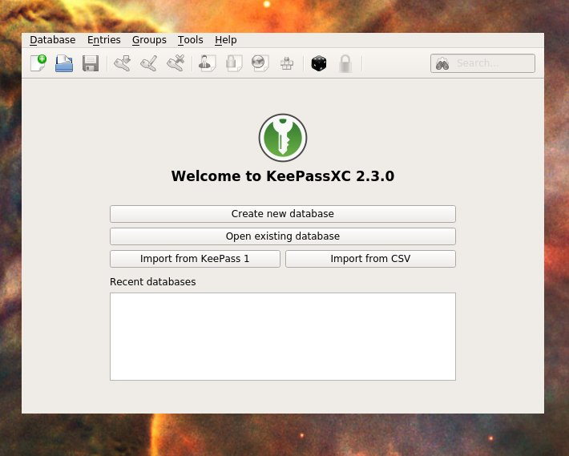
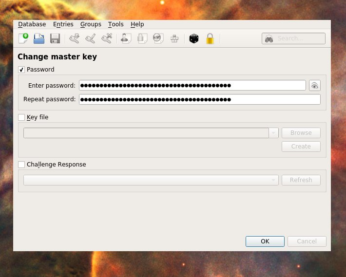
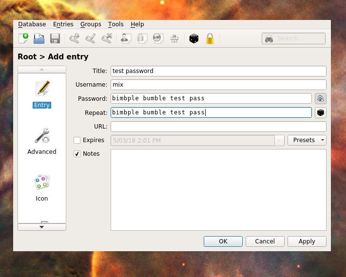
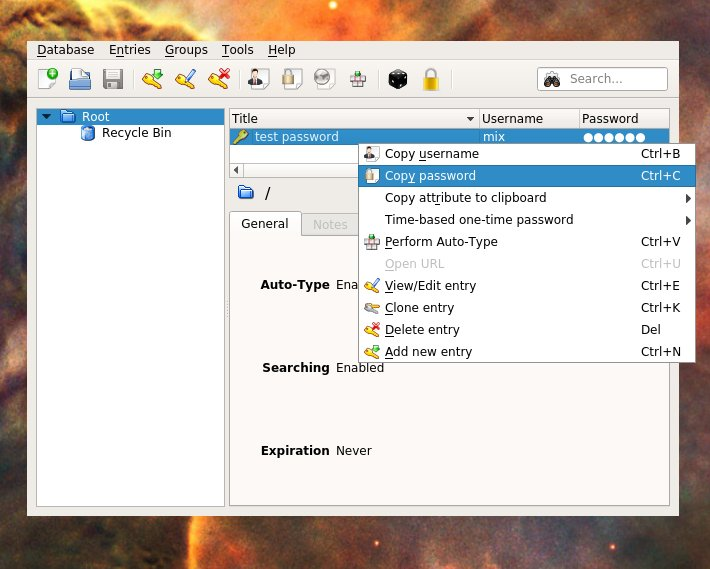

# Guide to using Keepass XC password manager

The most secure passwords are long and difficult to remember.
Good news is, all you you need is an excellent password manager and it can remember all these long passwords.
We will make this safe by setting up on one single single "Master Password" which you need to know to get into the password manager.

_Check the FAQ at the bottom of this section if you have more questions_

**What you need for this section**:
- Read over the steps before you start
- 1 Strong Master Password
- The start of a security mindset - can someone else get into this? Can I get back into this?

1. **Install KeePassXC** 

    Get it from https://keepassxc.org/download/

    You may have to give permission to open this application as it's not from an App Store. If you get a warning try clicking things like "More info" or "?" to get to the place where you can say "Allow KeePassXC"

2. **Start a new password database**
    
    (optional) see FAQ 'what is a database?'

    1. Open KeePass, and click `[ Ceate new database ]`
    
    
    
    2. Give it a name that makes sense like "mix_mmt_passwords" and click `[ Save ]`
    
    
    
3. **Choose your "Master Password"**

    :warning: Pay close attention, being sloppy here will compromise security
    
    This is the one password you have to remember. Requirements are:
      - Never use this password _anywhere online_
      - Never use this password _for anything else_
      - Your password must be very hard for humans and computers to guess 
          - Maybe use a line from a song or poem you like 
            - e.g. _"people say she's crazy she's got diamonds on the soles of her shoes"_
          - yes make it quite long

    1. Enter your new password (twice)
    2. Press '[ okay ]'
    
    

4. **Practice saving a password**

    This is to get you used to using KeePass AND to **prove to yourself that your setup is working**  - i.e. you can get your passwords out!
    KeePass lets you make folders, a feature we don't need yet - the default base folder is called "Root"
    
    1. Save a password in:
        1. click `Entries > Add new entry` in the menu
        2. enter some test details (you need to enter the pass twice, you can click the eye to reveal the passwords). 
        3. click `[ OK ]`
        
    
    
    2. Get the password out:
        1. right click on the new entry and copy the password
        2. paste that password somewhere else to prove your password is in there ok
        - e.g. mine comes out "bumble dumble test pass", so it's worked!
        
    

5. **Check the whole thing works**

    Prove you can close everything and then retreive the password again. This is to force you to use your master password, and prove to yourself that you know how to do all this.
    
    1. Close KeePass
    2. Open KeePass (and enter your **master password** to unlock it and get in)
    3. Check you can still see that test password (e.g. copy it out)

If you've got this all sorted, you're now ready to save your bitcoin passwords super securely!

### FAQ

Q: **I've already got a password manager**, can I just use that?
  - No. This is our opinionated recommendation about the simplest safest starting point
  - (advanced) yes perhaps, but we'd need to talk through the security. Please run with this to start with
  
Q: What's a **database**?
  - it's just a filing cabinet for storing things in! (In this case 'things' = data, like passwords)
  - with KeePass the database is just a special file, e.g. 'mix_mmt.kdbx`. If you delete that file, all the passwords in it will be lost.
  - KeePass lets you set up different databases, e.g. you might like to keep your work and personal passwords totally seperated. This is a more advanced case you don't need to worry about

