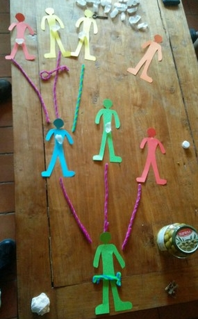

# Accessibility of Cryptographic Tools

## Questions put forward to groups

- What encryption tools do you currently use?  If you don't use encryption, why not?
- How do you back up your keys and passwords?
- Have you ever lost a key or password?  Why?
- Would you consider using a cloud service to backup keys or passwords?  Why?

### Summary of findings 

What we found was that most groups who did not use encryption had barriers because of lack of knowledge of how to set up the software.  But of groups who did use encryption, most reported at some point having had a problem with a lost password or key, and that key and password management was the most common source of problems.

### Encryption tools used  
Encrypted mobile messaging services
OpenSSH
PGP/GPG, Enigmail, Pretty Easy Privacy
Disk encryption: Veracrypt, Dmcrypt, EncFS, Ecryptfs, Tomb
Keybase

### Most commonly used methods to backup keys

TODO: make pi chart with R 

- External storage media kept at home
- External storage media kept with a friend or family member
- External storage media kept elsewhere
- Hard copy
- No backup
- Private remote server
- Using a cloud service

### Password managers used

- Web browser extensions
- Dashlane
- 1Password
- KeePass
- Lastpass
- MasterPassword
- Bitwarden
- passbolt
- pwsafe
- PasswordBox
- GNOME Keyring Manager / Seahorse
- Pass (passwordstore.org)

### Problems encountered using password managers

- Forgot/lost master password
- Lost database file

### Reasons for / for not using cloud service

#### For using
- Easy of use
- Less likely to get lost
- Not having to make personal backups

#### For not using
- They're too expensive
- Don't trust them
- Don't know of a good provider

## Secure-scuttlebutt dead accounts survey

Secure scuttlebutt is a social network which relies on cryptographic keys for identity.  Unlike popular centralised services there is no password-reset functionality.  If a private key is lost, users can no longer use that identity.  So the responsibility of holding custody of the key is entirely up to the user.

We made a call out for the public keys of accounts known to be deprecated (the private key assumed to be lost), and asked how and why the key was lost.

Of 43 deprecated accounts we found:
- 11 due to hardware failure,
- 12 due to having to reinstall computer and forgetting to backup key
- 3  other reasons
- 17  unknown

Full details can be found on secure scuttlebutt under #deprecatedSSBAccounts 

# Feedback from our workshops on setting up password managers

### Workshops at Work.Life, London fields https://work.life/locations/london-fields/, 
Lead by dan, assisted by keiran, 8 workshops over 3 months, teaching setup and use of Keepass, and public key cryptography at entry level.
(image?)

#### Reflections from the first three workshops:

So, the workshops aimed to teach people how to manage their private keys securely. This workshop could also have been called 'How to use a password manager' (totes not sexy and would have had attendee population of 0 I am guessing ;) )
      
##### Workshop 1

About 20-30 people turned up. I went WAY too deep into 'what's a blockchain'. I didn't create space for a lunch break -- overall was a bit of a disaster, though people were very nice about it, and there was some learning that happened.
It was about 45:55 women:men and about 25:75 #BIPOC : #Caucasian , about 20:80 #LGBQTI : #cis
I think there was a really wide range of expectations and reasons people were there and I didn't necessarily create a great container for learning.
There was ALOT of me talking and ALOT of theory and not much practical doing. These were some of the biggest takeaways.

##### Workshop 2

This was a private workshop with 2 friends from workshop 1. These friends planned teach crypto to people involved in the #LGBQTI social center they're in the process of setting up in #athens .
In this workshop we went through the process of setting up a password manager, how to make strong passwords. We set up a btc wallet and securely stored the private key. We went through exchanges and localbitcoins and actually sent some coins and handeled those.
They then had the homework of going away and setting up an #ethereum wallet and a #neo wallet.
This workshop showed me that even with technically proficient people, this stuff takes time. Another takeaway was that it is much more potent to focus on teaching teachers, than it is to spread yourself thin by giving a shallow intro to lots of people.

##### Workshop 3

This with the same participants as workshop 2 and we went through the whole process again with #bitcoin #ethereum and #neo
At the end of this both of my friends were starting to feel much more used to the concepts and the practicalities and we started to think about what this might look like in a different context with people at the social center.
Bleep also made a bunch of notes which has started to form as a repository for the steps to start diffusing the knowledge. Some of this material can be found in the #MMT #github repo wiki here"

### Workshop at Afrotech fest London, 26-27th January 2018 https://2018.afrotechfest.co.uk/ 
Run by Dre (advisor), Lyn, Kieran.  [Full report here](./afrotech_review.md)

The workshop was designed to enourage adoption of a password manager, to attempt to work out the barriers to using this technology, and alert us to who was already using a password manager in the space.

- There was only one other person, other than us (the workshop hosts), who was using a password manager (1Password).
- Adoption was limited, primarily due to attendee's not coming prepared. Out of the 40+ attendees, there were only 4 computers at the workshop.
- Those with a computer and the capacity to install KeePass were encouraged to do so. Feedback from users reflected on the following:
  * Single source of failure
    - What if I lose or forget my password?
    - What happens if I become incapacitated?

  * Internet Connection
    - "Isn't relying on the internet to access my passwords a problem?"
    - In the context a client-side need for a password (such as a crypto wallet), isn't it problematic to rely on the internet to gain access?

  * Data Security / Integrity
    - What happens if someone hacks my cloud account?
    - What happens in the event of a data-leak by my cloud provider? This has happened before, see major Dropbox leak in 2012. Data beaches happen on a daily basis, often without the service provider knowing.

### Sharding workshop at mmt event in New Zealand

### Sharding workshop at the Network Convergence, Catalonia, July 2018 https://stories.greaterthan.finance/exploring-the-ecosystem-d03b07448b83

### Events at space4, London http://space4.tech/

### Guides used
Our KeePass XC guide: https://github.com/blockades/mmt_resources/blob/master/guides/keepass_xc_guide.md

Our Masterpassword guide: https://github.com/blockades/mmt_resources/blob/master/guides/masterpassword.md

### Feedback from one user following the guide independently

"On linux Mint, there were no problems installing KeepassXC.  

The instructions for setting up KeepassXC were very good, and its great to have a guide with a 'practicing' stage, not just do this then do this...

I was a bit cautious about using the diceware website to generate the password.  Is that safe?  It is also possible to generate a random password using Keepass.  Also it doesn't include punctuation characters by default.

Similarly I was cautious about pasting the seed into dyne.org 'secrets' web-based sharding tool.  I heard you should never enter your password on a website.

The whole process took about 2 hours."

## Similar research

Frenkel, K (2014) "Key management a barrier to encryption adoption" https://www.cioinsight.com/security/slideshows/key-management-a-barrier-to-encryption-adoption.html - based on 'Global encryption trends study' by the Ponemon Institute 

When asked 'How painful is key management', more than half of those surveyed rated the challenge of managing keys or certificates 7 on a scale of 1 to 10.  30% of organizations rated key management at 9 or 10 on the pain scale.

-------

# Posts off ssb 

i think this was dan:
    
I used to use Dashlane which is awesome but it got too expensive (i got some promotional plan for 3 years for cheap). Then i switched to keepass archive that i sync to my machines with other stuff. 

That saying to introduce new people to password managers i tell them a story.

Last year I programmed web application form for art/design competition. Many of my friends applied. It was few thousand applicants and you had to register to fill the form. Then i tell them that i got all of their personal data including email and password that they used to register. I tell them i can use this information to login to common services because most of people use only few passwords. 

You should see their faces. I am the worst person in the room by then.

In reality the application form was passwordless and used one time email token to login. Because i don't want to have anything to do with others people passwords! But nobody remembers that. 

It works very well. After that i introduce them to

https://haveibeenpwned.com/

By that time I have their attention and everyone wants password manager.

I don't recommend keypass it is too much hustle to sync to mobile. Luckily there is newish open-source project https://bitwarden.com/ - you can start using their servers for free if you want more functionality you can pay them something (very cheap compared to commercial services) but you can also selfhost your server. It is much more approachable than other solutions.

I would pick that nowdays not keepass.

%pk73nNx1mKnkciIsWFwkwlhIStFzz8+XzrvQaR5l218=.sha256

       "The genesis of the project and the germination began when a friend runs a 'tools for the coming difficult times' blog (http://crucible.tools/) asked me to contribute a post about what I thought might be useful. It was around the time that #blockstream put #bitcoin in orbit (https://blockstream.com/satellite/) opening up the potential for participating in the #networkwithout needing internet access. I thought about the stories of people crossing borders fleeing Syria having their belongings stolen, as law (https://www.theguardian.com/world/2016/jan/26/danish-parliament-approves-plan-to-seize-assets-from-refugees) . So it got me thinking about #cryptocurrency as a means of mobility without material belongings. So I got to working thinking about this might work in practice."
  
%mT9ngzsXUJat6OD91gTPZt4L0RdpgNqfMkj//FiW+mo=.sha256 
    
