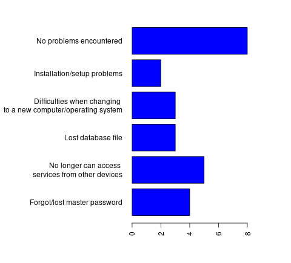

# Accessibility of Cryptographic Tools

This is a collection of findings from:
- Interviews with groups and individuals about issues around passwords, keys and encryption
- Our survey of deprecated accounts on SSB
- Feedback and reflections on workshops we have run over the last two years.

## Participants interviewed

We spoke to members of our extended friendship networks, groups we have contact with, some of whom are involved in political activism, participants of the workshops we have run, and users of the scuttlebutt network.  Therefore, these findings cannot be said to be representative of the general population.

### Questions put forward

- What encryption tools do you currently use? 
- What encryption tools do you not currently use but would like to?  What are the reasons?
- How do you back up your keys and passwords?
- Have you ever lost a key or password?  Why?
- Would you consider using a cloud service to backup keys or passwords?  Why?

### Summary of findings 

What we found was that most groups and individuals who did not use encryption did so because of lack of knowledge of how to set up the software, and a lack of time to invest to learn how.  But of groups who did use encryption, most reported at some point having had a problem with a lost key or password, and that key and password management was the most common source of problems.

Of the users who used cloud-based backup services, none used them to backup keys or certificates, only passwords to web services. 

Many users reported that they would not trust cloud based services.  Those involved in activism were particularly cautious. 

### Encryption tools people use  
- Encrypted mobile messaging services - by far the most popular
- OpenSSH
- PGP/GPG, Enigmail, Pretty Easy Privacy (primarily for encrypted email but also used for file encryption, password encryption, and signing git commits).
- Disk encryption software including: Veracrypt / Truecrypt, Dmcrypt, EncFS, Ecryptfs, Tomb
- Keybase, which combines a multi-service key directory, a cross platform messaging service, encrypted storage and encrypted git hosting.

### Encryption software people would like to use but currently do not

- Email encryption
- Disk or file encryption

### Reasons for not using them

A reason that kept coming up was time.  "I dont have time to set it up", "It probably takes ages", "I've been meaning to do it but never got around it".

Another was lack of knowledge, the assumption that one needs to be extremely technically proficient to use such tools, and a fear of loss of access to data if a mistake was made.

Some users had taken the time to get a working GPG encrypted email configuration but now used a newer device and had not set it up again or copied across their keys.  One user had published a key to a public keyserver without an expiry date, and then lost the corresponding private key.They explained that they did not set an expiry date because it seemed more valuable to have a key which could be used indefinately. 

In the case of disk encryption, people were understandably unwilling to reinstall their operating system in order to get it set up.  Again, fear of loosing access to their data was also an issue. 

### Password managers people use

By far the majority (33 users) did not use a password manager.

- [Dashlane](https://www.dashlane.com/) (Local installation with cloud sync) - 1 user
- [1Password](https://1password.com/) (Local installation with cloud sync) - 1 user
- [KeePass / KeePassX / KeePassXC](https://keepassxc.org/) (Local installation) - 5 users
- [Lastpass](https://lastpass.com) (Cloud based) - 2 users
- [MasterPassword](https://masterpassword.app/) (Deterministic) - 1 user
- [Bitwarden](https://bitwarden.com/) (Cloud based) - 1 user
- [passbolt](https://www.passbolt.com/) (Team-focused, self hosted) - 1 user (who also had a personal password manager)
- [pwsafe](https://pwsafe.org/) (Local installation) - 1 user
- [PasswordBox](https://passwordbox.en.softonic.com) (Browser extension, functionality unknown) - 1 user
- [GNOME Keyring Manager / Seahorse](https://wiki.gnome.org/Projects/GnomeKeyring) - 2 users
- [GNU Pass](http://www.passwordstore.org) (Local installation with git sync) - 3 users
- Other browser extensions - 5 users

### Problems encountered using password managers

### Reasons for / for not using password managers backed by cloud service

#### For using
- Easy of use
- Good solution for accessing from multiple devices
- Less likely to get lost
- Not having to make personal backups, or manually sync across devices

#### For not using
- Too expensive / not found a good free provider
- Lack of trust in them
- Don't know of a reputably secure provider

### Most commonly used methods to backup keys

This was only of users of encryption software other than encrypted mobile messaging services, since such services typically do not give the user total responsibility for key management. For example, in the case of a lost device, keys can often be regenerated with a by a device with a new sim card with the same number.  Access to the old messages are lost but the users identity appears to persist. 

Almost half of users simply did not back up their keys. Of those who did, most used external storage, such as a USB stick hard disk, or second computer, which they kept at home. None used a cloud service.

### Limitations of the study

Getting people to talk openly about their security habits can be difficult, especially if it is for research that will be published publicly. People involved in activism tend to be very cautious, and people who we didn't know personally were very unwilling to give much information away. There were some examples of security problems which we were unable to gain consent to publish here. 

## Secure-scuttlebutt dead accounts survey

Secure scuttlebutt is a social network which relies on cryptographic keys for identity.  Unlike popular centralised services there is no password-reset functionality.  If a private key is lost, users can no longer use that identity.  So the responsibility of holding custody of the key is entirely up to the user.

We made a call out for the public keys of accounts known to be deprecated (the private key assumed to be lost), and asked how and why the key was lost.

Of 43 deprecated accounts we found:
- 11 due to hardware failure,
- 12 due to having to reinstall computer and forgetting to backup key
- 3  other reasons
- 17  unknown

Full details can be found on secure scuttlebutt under #deprecatedSSBAccounts 

# Feedback from our workshops on setting up password managers

### Workshops at [Work.Life, London fields](https://work.life/locations/london-fields) 
Lead by dan, assisted by Kieran, 8 workshops over 3 months, teaching setup and use of 'Keepass'/'Bitwarden', and public key cryptography at entry level.

#### Some Reflections from the first three workshops:

So, the workshops aimed to teach people how to manage their private keys securely. This workshop could also have been called 'How to use a password manager' (totes not sexy and would have had attendee population of 0 I am guessing ;) )

I used to use Dashlane which is awesome but it got too expensive (i got some promotional plan for 3 years for cheap). Then i switched to keepass archive that I sync to my machines with other stuff. 

That saying to introduce new people to password managers I tell them a story.

Last year I programmed web application form for art/design competition. Many of my friends applied. It was few thousand applicants and you had to register to fill the form. Then I tell them that I got all of their personal data including email and password that they used to register. I tell them I can use this information to login to common services because most of people use only few passwords. 

You should see their faces. I am the worst person in the room by then.

In reality the application form was passwordless and used one time email token to login. Because I don't want to have anything to do with others people passwords! But nobody remembers that. 

It works very well. After that I introduce them to [haveibeenpwned.com](https://haveibeenpwned.com/), a site which lets people check if you have an account which has been compromised in a data breach based on a repository of know data breaches (which is also a promotional site for password manager '1Password').

By that time I have their attention and everyone wants password manager.

I no longer recommend 'keepass' it is too much hassle to sync to mobile. Luckily there is newish open-source project [bitwarden](https://bitwarden.com/) - you can start using their servers for free if you want more functionality you can pay them something (very cheap compared to commercial services) but you can also self-host your server. It is much more approachable than other solutions.

I would recommend that nowadays, not keepass.

##### Workshop 1

About 20-30 people turned up. I went WAY too deep into explaining things. I didn't create space for a lunch break -- overall was a bit of a disaster, though people were very nice about it, and there was some learning that happened.
It was about 45:55 women:men and about 25:75 #BIPOC : #Caucasian , about 20:80 #LGBQTI : #cis
I think there was a really wide range of expectations and reasons people were there and I didn't necessarily create a great container for learning.
There was ALOT of me talking and ALOT of theory and not much practical doing. These were some of the biggest takeaways.

##### Workshop 2

This was a private workshop with 2 friends from workshop 1. These friends planned teach crypto to people involved in the #LGBQTI social center they're in the process of setting up in #athens .
In this workshop we went through the process of setting up a password manager, how to make strong passwords. We set up a btc wallet and securely stored the private key. We went through exchanges and localbitcoins and actually sent some coins and handeled those.
They then had the homework of going away and setting up an #ethereum wallet and a #neo wallet.
This workshop showed me that even with technically proficient people, this stuff takes time. Another takeaway was that it is much more potent to focus on teaching teachers, than it is to spread yourself thin by giving a shallow intro to lots of people.

##### Workshop 3

This with the same participants as workshop 2 and we went through the whole process again with Keepass.
At the end of this both of my friends were starting to feel much more used to the concepts and the practicalities and we started to think about what this might look like in a different context with people at the social center.
Bleep also made a bunch of notes which has started to form as a repository for the steps to start diffusing the knowledge. Some of this material can be found in the #MMT #github repo wiki here"

### Workshop at Afrotech fest London, 26-27th January 2018 https://2018.afrotechfest.co.uk/ 
Run by Dre (advisor), Lyn, Kieran.  [Full report here](https://github.com/blockades/mmt_resources/blob/master/research/afrotech_review.md)

The workshop was designed to encourage adoption of a password manager, to attempt to work out the barriers to using this technology, and alert us to who was already using a password manager in the space.

- There was only one other person, other than us (the workshop hosts), who was using a password manager (1Password).
- Adoption was limited, primarily due to attendee's not coming prepared. Out of the 40+ attendees, there were only 4 computers at the workshop.
- Those with a computer and the capacity to install KeePass were encouraged to do so. Feedback from users reflected on the following:
  * Single source of failure
    - What if I lose or forget my password?
    - What happens if I become incapacitated?

  * Internet Connection
    - "Isn't relying on the internet to access my passwords a problem?"
    - In the context a client-side need for a password (such as a crypto wallet), isn't it problematic to rely on the internet to gain access?

  * Data Security / Integrity
    - What happens if someone hacks my cloud account?
    - What happens in the event of a data-leak by my cloud provider? This has happened before, see major Dropbox leak in 2012. Data beaches happen on a daily basis, often without the service provider knowing.

### Sharding workshop at mmt event in New Zealand

[Full report here](https://github.com/blockades/mmt_resources/blob/master/research/mmt_retreat_sharding_secrets_workshop.md)

### Sharding workshop at the Network Convergence, Catalonia, July 2018 https://stories.greaterthan.finance/exploring-the-ecosystem-d03b07448b83

Here we presented and explored secret sharding concepts using a role playing game, and spoke to people about potential use cases, their own needs, and stories of lost keys. 

### Events at space4, London http://space4.tech/

### Guides used
Our KeePass XC guide: https://github.com/blockades/mmt_resources/blob/master/guides/keepass_xc_guide.md

Our Masterpassword guide: https://github.com/blockades/mmt_resources/blob/master/guides/masterpassword.md

### Feedback from one user following the guide independently

"On linux Mint, there were no problems installing KeepassXC.  

The instructions for setting up KeepassXC were very good, and its great to have a guide with a 'practicing' stage, not just do this then do this...

I was a bit cautious about using the diceware website to generate the password.  Is that safe?  It is also possible to generate a random password using Keepass.  Also it doesn't include punctuation characters by default.

Similarly I was cautious about pasting the seed into dyne.org 'secrets' web-based sharding tool.  I heard you should never enter your password on a website.

The whole process took about 2 hours."

## Password Generators

We found that although some people use password generators to generate random password strings from within their password manager, not many people use password generators to create strong, memorable master passwords. 

We looked at some different tools for doing this, and also developed an [n-gram based pronounceable non-dictionary word generator](https://github.com/blockades/ngram-pwgen).

* [Diceware](https://www.rempe.us/diceware/#eff) - Strong memorable password generator 
* [Strong Random Password Generator](http://passwordsgenerator.net/) - Generates a password together with some words to help you remember it
* [passwds.ninja](https://passwds.ninja/) - Generates pronouncable strings based on a template of where vowels and consonants should be.
* [securepasswords](https://www.npmjs.com/package/securepasswords) - node module for a password generator which is supposed to create passwords which are easy to type on english and german keyboards
* [Electronic Frontier Foundation wordlists](https://www.eff.org/deeplinks/2016/07/new-wordlists-random-passphrases) along with an interesting explanation. These wordlists are used by [rempe.us/diceware/#eff](https://www.rempe.us/diceware/#eff)
* [XKPasswd - Secure Memorable Passwords](https://xkpasswd.net/s/) - a password generator with plenty of nice features.
* [Secrets of the Dark](https://direclown.wordpress.com/tag/javascript/) - a review of some password generators
* [Strong Pass - Secure Deterministic Password Generator](https://www.rempe.us/strongpass/) - this is actually a barebones deterministic password manager.

## Similar research

Frenkel, K (2014) "Key management a barrier to encryption adoption" https://www.cioinsight.com/security/slideshows/key-management-a-barrier-to-encryption-adoption.html - based on 'Global encryption trends study' by the Ponemon Institute 

When asked 'How painful is key management', more than half of those surveyed rated the challenge of managing keys or certificates 7 on a scale of 1 to 10.  30% of organizations rated key management at 9 or 10 on the pain scale.  Note however, that this was a study of enterprise users, which are not our target user group.

-------

