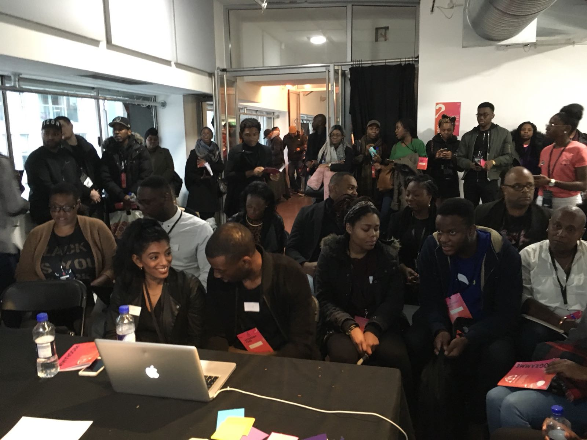
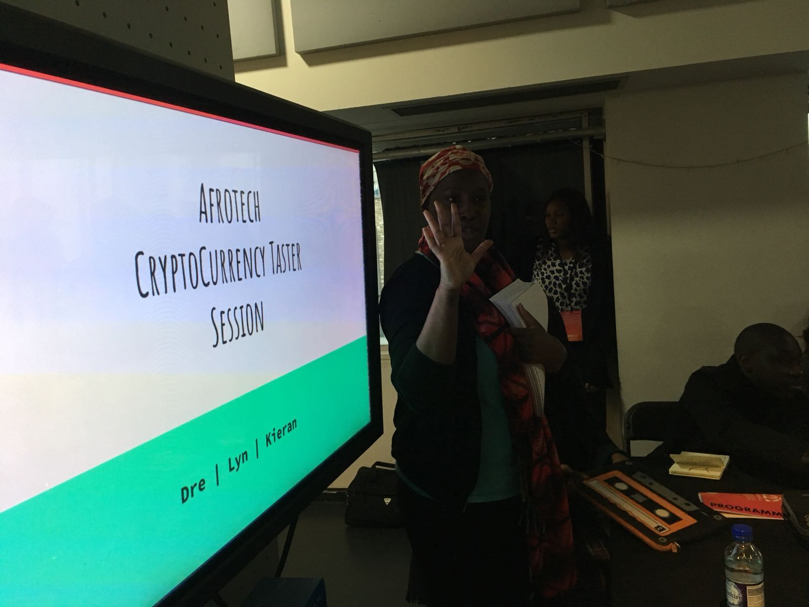
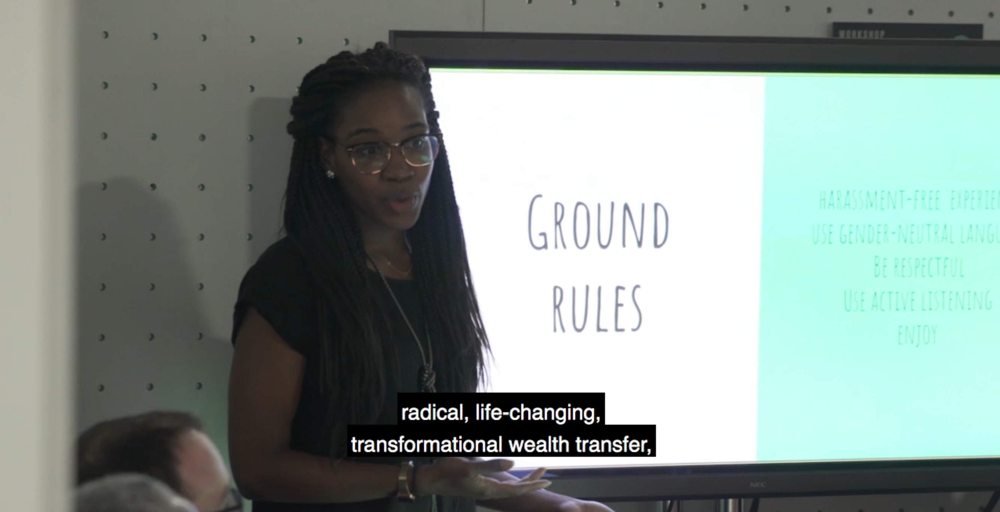

# Reflections on Afrotech 2018

Walkthrough guide for the workshop can be found [here](../guides/cryptoguide.md).

## Summary

First of all, the workshop, 'An Introduction to Cryptocurrency 101' was above and beyond a success in terms of turn-out, although perhaps to the detriment of the final workshop.
We drew in well over the capacity we had set for 13/14 participants (in the end we had around 40 people sitting in and around the workshop space).

In the end, the high turn out proved to be a limiting factor. Due to the volume of people, and being setup in an open-plan workspace, we were unable to apply our programme effectively and draw as much feedback about the tools used as we would have liked. Having a large volume of people crowded around, with people coming and going prevented us from effectively engaging on a one-to-one basis assisting people in adopting the use of a password manager. 

However there were some successes via observations from participants. Anxieties about the reliability of an internet connection to access passwords (the method we applied stored KeePass databases on the cloud, see the walkthrough link above), of forgetting, losing or being otherwise 'locked-out' of your password database.

Prior to the event we had requested more information about the layout of the space though this remained relatively unclear until the arriving.

Unfortunately we are unable to assess continued adoption of password managers from participants after the workshop and into the future, and/or the methodology we applied.

## 1. Adoption of Password Managers

The workshop was designed to enourage adoption of a password manager, to attempt to work out the barriers to using this technology, and alert us to who was already using a password manager in the space.

- There was only one other person, other than us (the workshop hosts), who was using a password manager (1Password).
- Adoption was limited, primarily due to attendee's not coming prepared. Out of the 40+ attendees, there were only 4 computers at the workshop.
- Those with a computer and the capacity to install KeePass were encouraged to do so. Feedback from users reflected on the following:
  * Single source of failure
    - What if I lose or forget my password?
    - What happens if I become incapacitated?

  * Internet Connection
    - "Isn't relying on the internet to access my passwords a problem?"
    - In the context a client-side need for a password (such as a crypto wallet), isn't it problematic to rely on the internet to gain access?

  * Data Security / Integrity
    - What happens if someone hacks my cloud account?
    - What happens in the event of a data-leak by my cloud provider? This has happened before, see major Dropbox leak in 2012. Data beaches happen on a daily basis, often without the service provider knowing.

## 2. Understanding of Blockchain and MyEtherWallet

Its difficult to assess what the reception of understanding of Blockchain technology was in the room. The workshop was not targeted specifically at this problem, and the financial incentive of receiving and exchanging some Ether with co-participants at the end of the workshop if a wallet had successfully been created was not achieved due to time contraints.

Out of the 4 participants with computers, 3 of them effectively setup a MyEtherWallet and securely stored their KeePass database containing their private key with their chosed cloud provider.
Of those 3, 2 successfully emailed us (the facilitators) with their public address, and received a small deposit of Ether to their wallets.

## Evaluation

As a group (3 workshop facilitators) we agreed we would not run this workshop again at this scale. Having 40+ people means drawing effective conclusions about people's experience using the technology is limited. Our original scope is one we would be strict about keeping to, and would communicate more clearly with the organisers in future.

However, drawing from the experiences of those involved, it was clear that some conclusions could be made about people's concerns with the technology and the approach.

## Pictures

