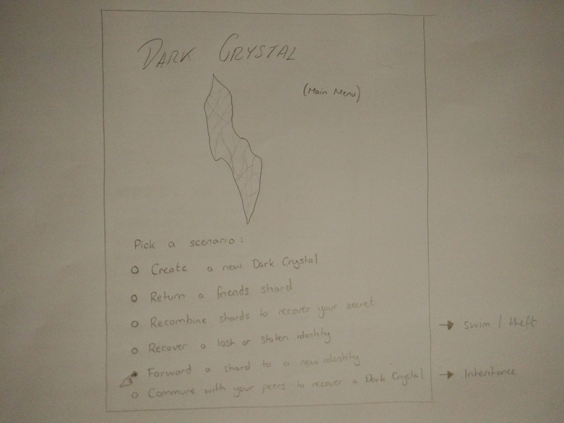
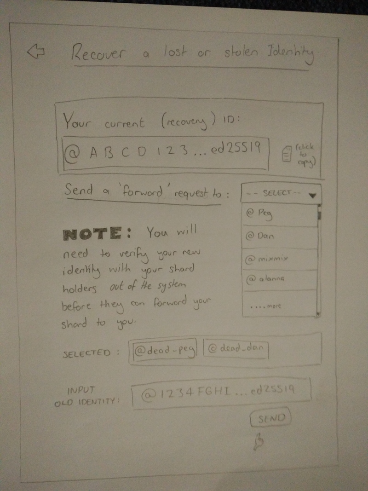
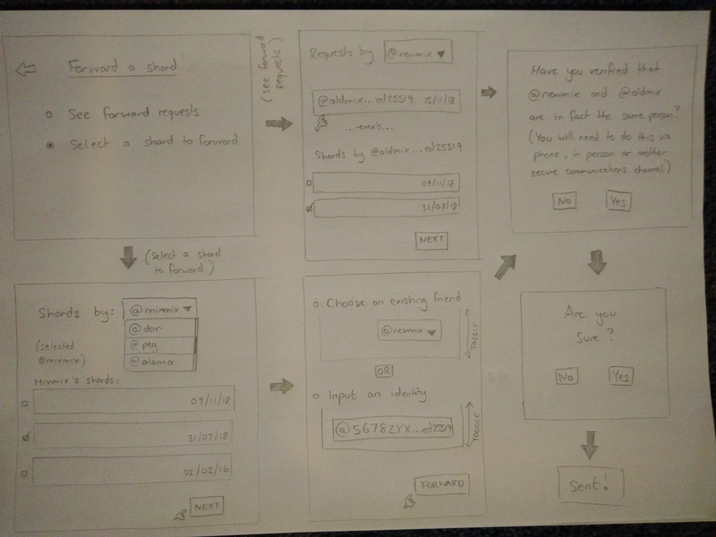

Hey all,

So in my previous post 'Falling Coconuts' I really wanted to emphasise an approach to the UI which takes a scenario based / narrative based approach.

> The Dark Crystal interface really needs to separate user-flows and its narrative based on the differing scenarios / recovery strategies.... the options to 'Return a Shard' and 'Forward a Shard' should not be in the same view. They could be easily mixed up and could result in a dramatic failure...

So here's some thoughts on what the interface could look like. I've added scenario-pathways for `swim / theft` and the forward action.

## Home View 

Home view specifies 6 different user-choice pathways through the application.

1. Create a new Dark Crystal
2. Return a friend's shard
3. Recombine shards to recover a secret

These three views already exist in our prototype application. Pathway 2  aligns with the 'Others Shards' section. Pathway 3 aligns with the exiting Dark Crystal Show view.

4. Recover a lost of stolen identity - `swim / theft`
5. Forward a shard to a new identity
6. Commune with your peers to recover a Dark Crystal - `inheritance`

## Recover View

This is much like Dan's view above, but I've added the capacity to request someone to forward a shard to you. This means when you've gotten reconnected to the network via a pub, you will be able to see your shard holders and message them directly with a request that they can respond to with a `dark-crystal/forward` message (maybe a nice to have at this stage). Or you can copy your new identity string and send it to them via a different communications platform. The positive of having a request system again is it takes the weight off the custodian of having to type in a `@public_key_.ed25519` (and possibly making a mistake). It means a request can be send, then you can message someone out-of-band saying 'Yo, that was me', they can confirm with you via a secure means and then its super easy for them to forward...

## Forward View

So here we've got two potential pathways.

1. See forward requests
2. Select a shard to forward

Both will end with the same warnings!

The forward requests area allows a custodian to cross-reference requests from an new identity with shards from an old identity and select the one they want (which one to choose is likely going to have to be worked out out-of-band as we're not publishing any shard metadata at the moment). 

The select a shard to forward area allows you to choose against your list of friends OR input an identity string.

---

I haven't done a view for scenario 6 - Commune with your peers to recover a Dark Crystal - `inheritance` (coconut death 4 realz). There's a bit more involved in this and possible other pathways within it.

So I feel like taking this kind of approach is important because it separates `return shard` completely from `forward shard` and makes it quite easy to understand what course of action is the right course of action. Also by streching it out into multiple views, it gives more space for warnings and information. Having it all compacted into a single view feels a bit dicey and doesn't leave much room for info notes or other helpful messages on how to use the app correctly.

