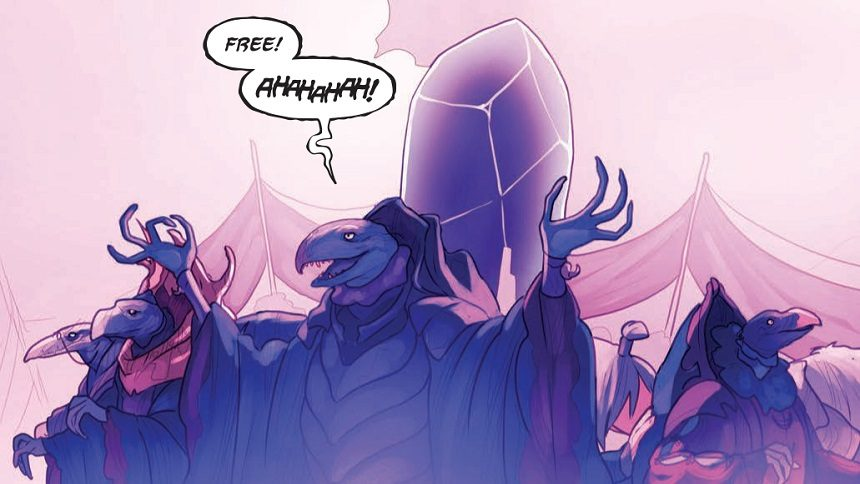

# MMT Retreat - Sharding Secrets Workshop / Game Notes



**Things we'll need for the workshop:**
- 3 cutout people per person
- Pipe cleaners
- Coloured string or wool
- Coloured markets / felt-tip pens
- Cutout crystals
- Willingness to play

### What is this about?

Social backups is an attempt to utilise Adi Shamir's secert sharing cryptographic algorithm to produce a social recovery protocol for private keys within a consenting and trustful private network.

- It depends on and praises coherency, trust and consent within networks.
- It operates on trust, but can account for a certain level of broken trust.
- It also makes use of the next step in your own network, to extend the layer of accountability.

#### Why?

* The individual is saddled with a huge sense of responsibility, and is the single point of failure. Individual backup mechanisms for private keys need to be rigorous and still leave room for mistake, loss and failure, and it rests solely on the individual.

* Use of secret sharing algorithms through tools such as Dyne's secrets, TrueName or others still have a certain overhead. It solves the 'technical' problem of cryptographically breaking up a secret into parts, but does not assist with the social distribution of your secret.

* As still an early generation using cryptography and public key infrastructure (PKI), and now in particular in relation to cryptocurrency, we do not have the mechanisms to account for death, loss or unforseen events that may lead to loss of keys and as such loss of an identity and the history, knowledge and wealth attached to that identity. Perhaps at the moment we may store a private key copy on paper in a location in our house, which may be discovered amongst our belongings at a later date, by anyone.

#### How is it to be used?

* What relationships is this software trying to encourage?
* What relationships are implicit in its current conception?

## The Basic Idea and some Crazy Diagrams

* (A) shards their secret with a 4-of-5 quorum. Sends to (B), (C), (D), (E), (F) their shard, and signs with their respective public key.
* (B), (C), (D), (E), (F) shards each key and sends to their own network, and signs with each the recipients public key.
* This can be replicated as many times as (A) requires.
```
                                                          A
                                                          |
            B -------------------- C -------------------- D ------------------ E ---------------------- F
            |                      |                      |                    |                        |
    H - I - J - K - L      M - N - O - P - Q      R - S - T - U - V    W - X - Y - Z - A1     B1 - C1 - D1 - E1 - F1
```

```
----------------------
|        M(k)        |  A(s) - A's shard
|   --------------   |  C(k) - A's shard with C's public key
|   |    C(k)    |   |  M(k) - M's shard A's secret encrypted with C's and then M's public key
|   |   ------   |   |
|   |   |A(s)|   |   |
|   |   ------   |   |
|   |            |   |
|   --------------   |
|                    |
----------------------
```

```
-------------       --------------
|    C(k)   |       |    M(k)    |
|  -------  |       |  --------  |
|  |S(As)|  |  -->  |  |S(CAs)|  |
|  -------  |       |  --------  |
|           |       |            |
-------------       --------------
```

* (A) loses their secret, and (C) has become incapacitated / inaccessible.
* In order to recover their secret, (A) must contact the quorum of (M), (N), (O), (P), (Q) to reassemble (C)'s shard.
* (A) can then contact (B), (D), (E) and (F) and combine with (C)'s reassembled shard to reassemble their lost secret.

---

## Lets play a game!

Hold a secret in your mind such as...
* SSB secret
* Lat/Lng coordinates to the Pirate Treasure
* BTC private key
...etc

You also have a network of 2 friends, give each one of them a name. Each of those 2 friends has friends of their own (which likely overlap!). Place the characters on the floor in front of you.

---
---

**ACTION**
* Implicate characters, assign identities to the cutout-people, so they're not faceless. 
* Have characters to behave in ways that can change and complexify the scenario as if it were real life.
* Get people to role-play each other's characters

Possible character traits to get people started...
- Private - by nature a private person, and is aware of their own privacy concerns
- Public - by nature a public person, happy to share most anything
- Cautious - won't engage with new technology unless its explicit what it's doing
- Cautious of responsibility - might reject being asked to look after something important

**NOTE:** If characters are based on real people, **please give them a different name**.

---
---

**ACTION:**
* Choose a cutout person to represent you
* Map out your friendship network using wool / coloured string
* Map out other friendship networks using more wool! Build a complex map. Go nuts. We can all be friends!

---
---

**ACTION:**
* Each person creates a key from a pipe-cleaner (the joys of stationary)
* For each key, set a number of 'cosigners' and a 'quorum', write it on a piece of paper and place it alongside the key.
* The paper here is illustrating the concept of an 'agreement'. (Lets talk about language)

**RULES:**
* You can choose the same person for different keys
* You _cannot_ choose the same person for a single key
* Can / should you choose yourself?

**THINK:**
* What does consent mean in the context of this exercise?
* What does it mean to take responsibility for a piece of someone's secret / private key?
* What emotions can arise out of being asked to take that kind of responsibility?
* What are the barriers to that and why? What social/historical/emotional factors are going to affect people?
* What ethical dilemmas arise here?
* How does/can the software ensure security, provide assurance and give people control over their data?
* What ethics/values should the language used be emphasising and encouraging?

_Collate people's concerns, emotional reactions, thoughts and ethical issues on the board_

---
---

**ACTION:**
* Decide who you're going to shard each key with, mark each crystal with your initials, and place each shard alongside that cutout-person.

---
---

**ACTION:**
* _Meta-sharding_: For each shard, shard again with a new set of folk from their network. Thoughts around exactly how to do this. For the moment match, the cosigners / quorum.

---
---

**Stand back and look at the mess you've all made** :smiley:

---

#### Thoughts
* Layering of trust? For example, if your secrets network can be revealed using your SSB private key (though not your keys or their shards), it makes sense the ssb key should be sharded to those you trust the most in your life, i.e. siblings / partners / parents / closest friends.
* What communities are we trying to support / enrich?
* What are the implicit political ramifications of this technology?
