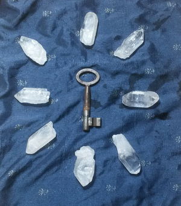

## Thoughts on verifying recieved shards in #darkcrystal


In 'dark crystal', shards are encrypted twice, once in that they are sent in an SSB private message, to both the shard recipient and the secret owner, and additionally, only the shard itself without the surrounding metadata is encrypted with the shard recipient's public key using [ssb-key's](https://github.com/ssbc/ssb-keys) 'box' method. This is effectively the same type of encryption, the difference is that the secret owner themselves has it in a message but cannot decrypt it.  This allows a secret owner to keep track of what was sent to who without holding the shards themselves.  

We were also hoping to be able to use this to defend against malicious tampering of shards by later verifying the received shards by re-encrypting them and checking if that matched what was initially sent.  

But this does not work because `box` (from ssb-keys) is not deterministic.  Encrypting the same string twice gives different output:
`box('foo',[someid]) != box('foo',[someid])`

I took a long look at [private-box](https://github.com/auditdrivencrypto/private-box) which is what we are currently using to encrypt shards to try to find a way to verify shard integrity.  Private-box has some **very** clever features which obfuscate who the message is intended for and mean they can be added to ssb feed which are essentially public. 

These features are not needed in this context since this is 'second level' encryption - once the encrypted shard is exposed it is already clear who the shard recipient is.  The actual encryption is done by libsodium's 'crypto_secretbox_easy' (using dominic tarr's [chloride](https://github.com/dominictarr/chloride)).

So I tried to simplify things a bit and just use the most basic public key encryption from libsodium to get something deterministic we can use for verification.

I'm pretty sure (correct me if im wrong) that if we would use basic RSA encryption we could get something deterministic quite easily.  But the problem would then be that we would need to use RSA keys.  But we want to stick to using our SSB keys since we already have them.  So its probably best to stick to the same libraries.  So here goes:

```js
var sodium = require('chloride')
var box  = sodium.crypto_box_easy
var box_open  = sodium.crypto_box_open_easy
var keypair = sodium.crypto_box_keypair

var yourKeys = keypair()
var myKeys = keypair()

var msg = Buffer.from( 'very nice', 'utf8' )
var nonce = randombytes(24) 
encryptedMessage = box(msg, nonce, yourKeys.public, myKeys.private)
originalMessage = box_open(encrypted, nonce, myKeys.public, yourKeys.private).toString()
```

The problem, and i guess this will always be an issue whichever library you use, is that you need a [nonce](https://en.wikipedia.org/wiki/Cryptographic_nonce) which should be unique for each message encrypted with those keys, to protect against [replay attacks](https://en.wikipedia.org/wiki/Replay_attack).  To recreate the encrypted message we would need to store this nonce value somewhere.  The other problem i hit, which is probably a trivial one to overcome, is that i could not use normal SSB keys generated with `ssbKeys.generate()`, even after converting them to buffers i got errors (maybe they have some special properties).

My opinion is, if we are going to need to store the nonce, as well as use an additional encryption method, it would be much easier just to store the hash of the shard and use that for verification later.  

For the iteration we are currently working on which assumes the secret owner is 'alive' and able to use thier ssb identity, storing them in the shard message makes sense.  But for the 'coconut death' scenario, it might make sense for each shardholder to hold the hashes of the other shardholder's shards.  

Note: This is a security feature which will probably rarely be needed.  It probably wont be included in v1 of dark crystal but i wanted to stick this here for future reference... 
